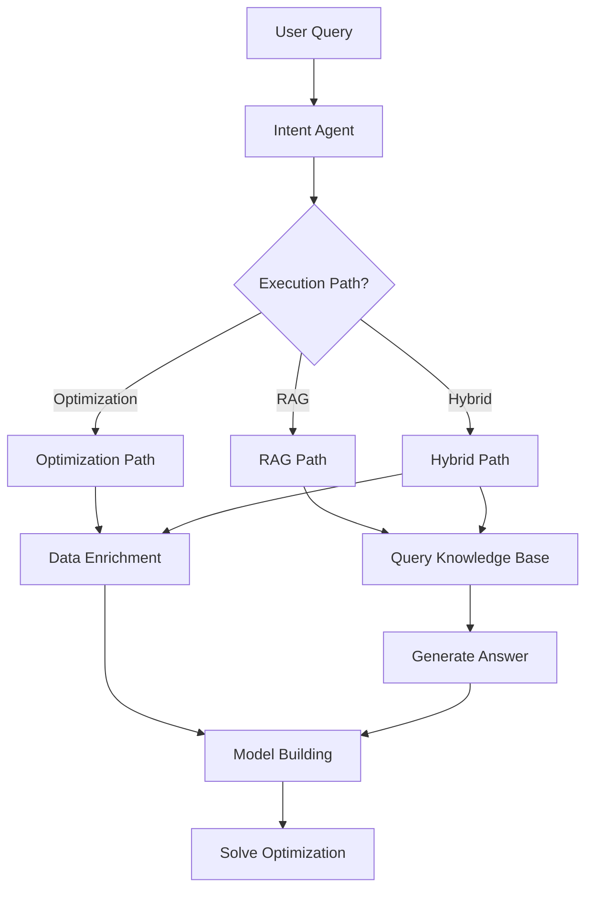

# Intent Agent Routing Guide: RAG vs Optimization

## Overview

The Intent Agent is the **decision-maker** in the DcisionAI platform that determines the appropriate execution path for user queries. It analyzes natural language requests and routes them to either:

1. **RAG (Retrieval-Augmented Generation)** - For knowledge queries
2. **Optimization** - For decision-making problems  
3. **Hybrid** - For complex requests requiring both

## Architecture



## Intent Agent Capabilities

### Decision Types

The intent agent can classify queries into these categories:

**Knowledge-Based (RAG Path):**
- `knowledge-query` - General information requests
- `best-practices` - Industry best practices
- `regulatory-compliance` - Safety and compliance requirements
- `historical-data` - Past project information
- `standards` - Industry standards and codes

**Decision-Making (Optimization Path):**
- `resource-allocation` - Resource assignment problems
- `scheduling` - Project scheduling and sequencing
- `cost-optimization` - Cost minimization problems
- `risk-management` - Risk assessment and mitigation
- `supply-chain` - Supply chain optimization
- `workforce-planning` - Staffing and crew allocation

### Execution Paths

#### 1. RAG Path (`executionPath: 'rag'`)

**When to Use:**
- Questions about knowledge, best practices, regulations
- Informational queries that don't require mathematical modeling
- Historical data analysis
- Compliance and safety information

**Examples:**
```
"What are OSHA safety requirements for scaffolding?"
"What are the best practices for concrete curing?"
"Tell me about LEED certification requirements"
"What are common causes of construction delays?"
"How do I handle change orders?"
```

**Output Fields:**
- `ragQuery`: Refined query for knowledge base search
- `decisionType`: Knowledge-related category
- `executionPath`: 'rag'

#### 2. Optimization Path (`executionPath: 'optimization'`)

**When to Use:**
- Decision-making requests requiring mathematical modeling
- Resource allocation and scheduling problems
- Cost optimization scenarios
- Multi-objective optimization problems

**Examples:**
```
"Optimize crew allocation for this project"
"Find the best schedule for these tasks"
"Minimize costs while meeting deadlines"
"Allocate resources optimally across multiple sites"
"Determine the optimal equipment mix"
```

**Output Fields:**
- `optimizationType`: Specific type of optimization problem
- `modelPath`: Path to optimization model template
- `extractedParams`: Parameters for the optimization model
- `executionPath`: 'optimization'

#### 3. Hybrid Path (`executionPath: 'hybrid'`)

**When to Use:**
- Complex requests requiring both knowledge and optimization
- Scenarios where best practices inform optimization decisions
- Risk-aware optimization problems

**Examples:**
```
"What are the best practices for crew scheduling, and then optimize our current schedule?"
"Tell me about risk management strategies, then optimize our project plan considering those risks"
"Get safety guidelines and optimize our resource allocation accordingly"
```

**Output Fields:**
- Both RAG and optimization fields populated
- `executionPath`: 'hybrid'

## Implementation Details

### Intent Agent Interface

```typescript
export interface IntentResult {
  decisionType: string;
  modelPath: string;
  extractedParams: Record<string, any>;
  confidence: number;
  reasoning: string;
  // New routing fields
  executionPath: 'rag' | 'optimization' | 'hybrid';
  ragQuery?: string;
  optimizationType?: string;
}
```

### Workflow Orchestrator Updates

The workflow orchestrator now handles all three execution paths:

```typescript
// Step 1: Intent Interpretation (determines path)
const intent = await agnoIntentAgent.interpretIntent(userIntent, sessionId);

// Step 2: Execute based on determined path
if (intent.executionPath === 'rag' || intent.executionPath === 'hybrid') {
  // Execute RAG query
  const ragResult = await this.executeRAGQuery(intent.ragQuery || userIntent);
}

if (intent.executionPath === 'optimization' || intent.executionPath === 'hybrid') {
  // Execute optimization workflow
  const enrichedData = await agnoDataAgent.enrichData(customerData);
  const mcpConfig = await agnoModelBuilderAgent.buildModel(enrichedData, intent);
  const optimizationResult = await this.solver.solveConstructionOptimization(problem);
}
```

### Explain Agent Enhancements

The explain agent now provides different types of explanations based on the execution path:

- **RAG Explanations**: Focus on knowledge insights, sources, and applicability
- **Optimization Explanations**: Focus on mathematical results, decisions, and metrics
- **Hybrid Explanations**: Combine both knowledge and optimization insights

## Usage Examples

### Example 1: RAG Query

```typescript
const userQuery = "What are OSHA safety requirements for scaffolding?";

const intent = await agnoIntentAgent.interpretIntent(userQuery);
// Result:
// {
//   decisionType: "regulatory-compliance",
//   executionPath: "rag",
//   ragQuery: "OSHA safety requirements scaffolding construction",
//   confidence: 0.95,
//   reasoning: "This is a knowledge query about safety regulations"
// }

const result = await executeConstructionWorkflow(null, userQuery);
// Returns RAG answer with sources and explanation
```

### Example 2: Optimization Query

```typescript
const userQuery = "Optimize crew allocation for this project";

const intent = await agnoIntentAgent.interpretIntent(userQuery);
// Result:
// {
//   decisionType: "resource-allocation",
//   executionPath: "optimization",
//   optimizationType: "crew_allocation",
//   modelPath: "models/crew_allocation.mcp",
//   extractedParams: { workers: [...], tasks: [...], constraints: [...] },
//   confidence: 0.92,
//   reasoning: "This requires mathematical optimization of resource allocation"
// }

const result = await executeConstructionWorkflow(customerData, userQuery);
// Returns optimization solution with mathematical results
```

### Example 3: Hybrid Query

```typescript
const userQuery = "What are the best practices for crew scheduling, and then optimize our current schedule?";

const intent = await agnoIntentAgent.interpretIntent(userQuery);
// Result:
// {
//   decisionType: "scheduling",
//   executionPath: "hybrid",
//   ragQuery: "best practices crew scheduling construction",
//   optimizationType: "crew_scheduling",
//   modelPath: "models/crew_scheduling.mcp",
//   confidence: 0.88,
//   reasoning: "This requires both knowledge retrieval and optimization"
// }

const result = await executeConstructionWorkflow(customerData, userQuery);
// Returns both RAG knowledge and optimization solution
```

## Testing

Run the intent routing tests:

```bash
npx ts-node src/dcisionai-agents/test-intent-routing.ts
```

This will test:
- Intent classification accuracy
- Path routing decisions
- Full workflow execution for each path
- RAG-only workflows
- Hybrid workflows

## Benefits

### 1. Intelligent Routing
- Automatically determines the best approach for each query
- No manual intervention required
- Handles complex multi-step requests

### 2. Resource Efficiency
- RAG queries don't require customer data or optimization setup
- Optimization only runs when mathematical modeling is needed
- Hybrid approach combines both efficiently

### 3. User Experience
- Natural language queries work seamlessly
- Appropriate responses for different query types
- Clear explanations for all result types

### 4. Scalability
- Easy to add new decision types
- Extensible routing logic
- Modular execution paths

## Configuration

### Intent Agent Configuration

```typescript
const intentAgent = await agnoIntentAgent.createSpecializedAgent(
  'anthropic', // model provider
  'claude-3-sonnet-20240229' // model name
);
```

### Workflow Options

```typescript
const options: WorkflowOptions = {
  modelProvider: 'anthropic',
  enableLogging: true,
  ragOptions: {
    topK: 5, // Number of sources to retrieve
    indexName: 'dcisionai-construction-kb'
  },
  solverOptions: {
    time_limit: 300, // Optimization time limit
    construction_heuristics: true
  }
};
```

## Future Enhancements

1. **Learning from User Feedback**: Improve routing accuracy based on user corrections
2. **Context-Aware Routing**: Consider conversation history and user preferences
3. **Multi-Modal Routing**: Support for image, document, and video queries
4. **Custom Routing Rules**: Allow users to define custom routing logic
5. **Performance Optimization**: Cache routing decisions for similar queries

## Conclusion

The Intent Agent routing system provides a sophisticated, intelligent approach to handling diverse user queries in the construction management domain. By automatically determining the appropriate execution path, it ensures that users get the most relevant and useful responses for their specific needs, whether they're seeking knowledge, optimization solutions, or both. 