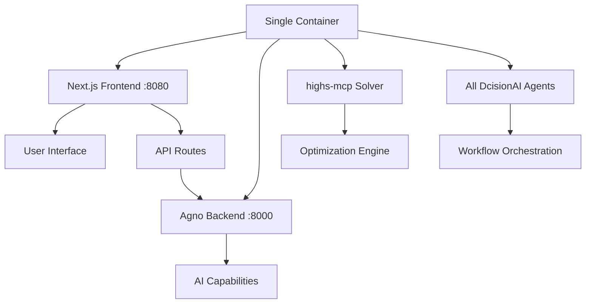

# Single Service Deployment Guide: Next.js + Agno Backend

## Overview

This guide documents the updated deployment architecture that combines the DcisionAI platform (Next.js) and Agno AI backend (Python) into a **single service** for simplified deployment and better performance.

## Architecture



## Key Changes Made

### 1. **Updated Dockerfile**
- **Added Python support**: Installs Python 3 and pip in all stages
- **Integrated Agno backend**: Copies and installs Python dependencies
- **Multi-stage optimization**: Maintains efficient build process
- **Production startup**: Uses custom startup script

### 2. **Production Startup Script** (`scripts/start-production.sh`)
- **Process management**: Starts both services with proper error handling
- **Health checks**: Verifies both services are running
- **Graceful shutdown**: Handles SIGTERM/SIGINT signals
- **Logging**: Clear status messages for debugging

### 3. **Updated Build Script** (`dist/dcisionai-platform/build-and-push.sh`)
- **Enhanced logging**: Better visibility into build process
- **Version tagging**: Adds commit SHA for traceability
- **Verification**: Runs health checks on built image
- **Environment variables**: Dynamic loading from `.env.local`

### 4. **Agno Client Updates** (`src/lib/agno-client.ts`)
- **Environment-based URL**: Uses `AGNO_BACKEND_URL` environment variable
- **Fallback support**: Defaults to `localhost:8000` for local development
- **Flexible configuration**: Works in both single-service and multi-service setups

### 5. **Verification Scripts**
- **Package verification**: `npm run verify:highs-mcp`
- **Service verification**: `npm run verify:single-service`
- **Health checks**: Tests both frontend and backend connectivity

## Deployment Process

### 1. **Local Development**
```bash
# Start both services locally
npm run dev

# Or use Docker Compose for full environment
docker-compose up
```

### 2. **Build and Push**
```bash
# Run the updated build script
./dist/dcisionai-platform/build-and-push.sh

# This will:
# - Build the single-service image
# - Run verification checks
# - Push to GitHub Container Registry
# - Tag with both 'latest' and commit SHA
```

### 3. **Deploy to Cloud Run**
```bash
# Deploy the single service
gcloud run deploy dcisionai-platform \
  --image ghcr.io/dcisionai/dcision-platform:latest \
  --platform managed \
  --region us-central1 \
  --port 8080 \
  --allow-unauthenticated
```

## Environment Variables

### **Required for Build**
```bash
# .env.local
GITHUB_TOKEN=your_github_token
NEXT_PUBLIC_SUPABASE_URL=your_supabase_url
NEXT_PUBLIC_SUPABASE_ANON_KEY=your_supabase_key
```

### **Required for Runtime**
```bash
# Cloud Run environment variables
ANTHROPIC_API_KEY=your_anthropic_key
OPENAI_API_KEY=your_openai_key
PINECONE_API_KEY=your_pinecone_key
AGNO_BACKEND_URL=http://localhost:8000  # Internal communication
```

## Service Ports

| Service | Port | Purpose |
|---------|------|---------|
| Next.js Frontend | 8080 | Main application interface |
| Agno Backend | 8000 | AI capabilities (internal) |
| External Access | 8080 | Only frontend port exposed |

## Verification and Testing

### **Package Verification**
```bash
npm run verify:highs-mcp
```
Checks that `highs-mcp` is properly installed and accessible.

### **Service Verification**
```bash
npm run verify:single-service
```
Tests both frontend and backend connectivity and integration.

### **Manual Testing**
```bash
# Test frontend
curl http://localhost:8080/api/health

# Test Agno backend (internal)
curl http://localhost:8000/health

# Test integration
curl http://localhost:8080/api/agno/health
```

## Benefits of Single Service Approach

### **1. Simplified Deployment**
- ✅ One service to deploy and manage
- ✅ No inter-service communication overhead
- ✅ Easier monitoring and logging
- ✅ Lower costs (one service instead of two)

### **2. Better Performance**
- ✅ No network latency between frontend and backend
- ✅ Shared resources and memory
- ✅ Faster response times for AI operations

### **3. Easier Development**
- ✅ Single codebase to maintain
- ✅ No need to manage multiple service URLs
- ✅ Simpler local development setup

### **4. Production Reliability**
- ✅ No network failures between services
- ✅ Simplified scaling and load balancing
- ✅ Easier debugging and troubleshooting

## Troubleshooting

### **Common Issues**

1. **Agno Backend Not Starting**
   ```bash
   # Check Python dependencies
   pip3 install -r agno-backend/requirements.txt
   
   # Check logs
   docker logs <container_id>
   ```

2. **Frontend Can't Connect to Backend**
   ```bash
   # Verify environment variable
   echo $AGNO_BACKEND_URL
   
   # Check internal connectivity
   curl http://localhost:8000/health
   ```

3. **Build Failures**
   ```bash
   # Clean and rebuild
   npm run clean:all
   docker build --no-cache .
   ```

### **Debug Commands**
```bash
# Check running processes
docker exec <container_id> ps aux

# Check network connectivity
docker exec <container_id> netstat -tlnp

# Check logs
docker logs <container_id> -f
```

## Migration from Multi-Service

If you were previously running separate services:

1. **Update environment variables**: Set `AGNO_BACKEND_URL=http://localhost:8000`
2. **Deploy single service**: Use the updated build script
3. **Update Cloud Run configuration**: Point to the new single-service image
4. **Test thoroughly**: Run verification scripts
5. **Monitor performance**: Check logs and metrics

## Future Enhancements

1. **Health Check Endpoints**: Add comprehensive health checks
2. **Metrics Collection**: Add Prometheus/Grafana monitoring
3. **Auto-scaling**: Configure Cloud Run auto-scaling policies
4. **Load Balancing**: Add load balancer for high availability
5. **Caching**: Implement Redis for session management

## Conclusion

The single service approach provides a more efficient, reliable, and maintainable deployment architecture for the DcisionAI platform. By combining the Next.js frontend and Agno backend in a single container, we achieve better performance, simpler deployment, and easier management while maintaining all the platform's capabilities.

---

**Ready to deploy!** 🚀

Run `./dist/dcisionai-platform/build-and-push.sh` to build and push your single-service image to production. 