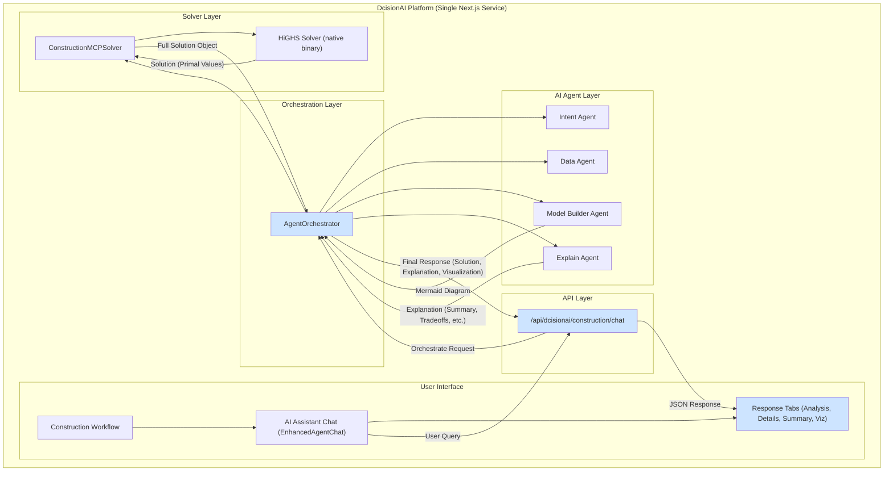

# DcisionAI Platform Architecture

## Overview

DcisionAI is a modern, cloud-native platform for construction optimization and decision-making. The platform provides a unified interface for solving complex construction problems using a sophisticated **multi-agent AI system** and the **Model Context Protocol (MCP)** framework.

The entire system is designed as a **single, cohesive Next.js application**, ensuring tight integration between the user interface, the AI agent layer, and the backend solvers.

## System Architecture

## Key Components

### 1. Frontend (Next.js)

**Location**: `src/pages/` and `src/components/`

The frontend is a rich, interactive application built with Next.js and TypeScript. It provides domain-specific workflows and a powerful AI-driven chat interface.

-   **Workflows**: Specialized UIs for Construction, Retail, and Finance.
-   **AI Assistant (`EnhancedAgentChat.tsx`)**: The primary user interaction component where users can submit natural language queries.
-   **Response Rendering (`ResponseTabs.tsx`)**: A key UI component that displays the orchestrated response from the backend in a clean, tabbed view:
    -   **Analysis**: Shows the `IntentAgent`'s analysis of the user's query.
    -   **Solution Details**: Displays the raw, structured solution from the solver, including variable values, objective value, and solver status.
    -   **Summary**: Presents a human-readable explanation from the `ExplainAgent`, including an executive summary, tradeoffs considered, and alternative solutions.
    -   **Visualization**: Renders a Mermaid diagram of the optimization problem.

### 2. API & Orchestration Layer

**API Location**: `src/pages/api/`
**Orchestrator Location**: `src/pages/api/_lib/AgentOrchestrator.ts`

-   **Chat API (`/api/dcisionai/construction/chat`)**: The main entry point for user queries from the frontend.
-   **Agent Orchestrator (`AgentOrchestrator.ts`)**: The brain of the backend. It receives requests from the API and coordinates the workflow between the different AI agents and the solver layer. Its key responsibilities include:
    -   Executing the agent workflow (Intent → Data → ModelBuilder → Solver → Explain).
    -   Aggregating the results from each agent.
    -   Assembling the final, structured response object containing the **solution**, the **explanation**, and the **visualization diagram**. This response is specifically formatted for consumption by the `ResponseTabs.tsx` component on the frontend.

### 3. AI Agent Layer

**Location**: `src/pages/api/_lib/dcisionai-agents/`

The AI Agent Layer provides specialized AI agents that work together to understand, process, and solve complex problems. These agents are stateful and managed through the `agno.ai` framework.

-   **Intent Agent**: Analyzes user input to determine the execution path (e.g., RAG, Optimization, Hybrid).
-   **Data Agent**: Enriches user data with domain-specific context.
-   **Model Builder Agent**: Converts the enriched data into a formal MCP (Model Context Protocol) model and generates a **Mermaid diagram** for visualization.
-   **Explain Agent**: Generates human-readable explanations of the final solution, including a summary, a discussion of tradeoffs, and alternative scenarios.

### 4. Solver Layer

**Location**: `src/pages/api/_lib/solvers/`

The solver layer is responsible for taking the MCP model and executing it using a mathematical optimization solver.

-   **Construction MCP Solver (`ConstructionMCPSolver.ts`)**: A specialized client that transforms the MCP model into a format understood by the HiGHS solver.
-   **HiGHS Solver (`highs.ts`)**: The core optimization engine. It's a high-performance, open-source solver that runs as a native binary.
    -   **Solution Parsing**: The HiGHS integration includes a robust parser that correctly handles the solver's output, distinguishing between **primal** and **dual** solution values to prevent data duplication.

## Data Flow: From Query to UI

1.  A user enters a query into the `EnhancedAgentChat` component in the UI.
2.  The query is sent to the `/api/dcisionai/construction/chat` endpoint.
3.  The `AgentOrchestrator` initiates the agent workflow.
4.  The `IntentAgent` classifies the query.
5.  The `ModelBuilderAgent` creates an MCP model and a Mermaid diagram.
6.  The `ConstructionMCPSolver` invokes the `HiGHS` binary to solve the model.
7.  The `ExplainAgent` generates a detailed summary of the solution.
8.  The `AgentOrchestrator` collects all these artifacts (solution, explanation, diagram) and packages them into a single JSON response.
9.  The frontend receives the JSON response, and the `ResponseTabs` component renders each piece of data in the appropriate tab.