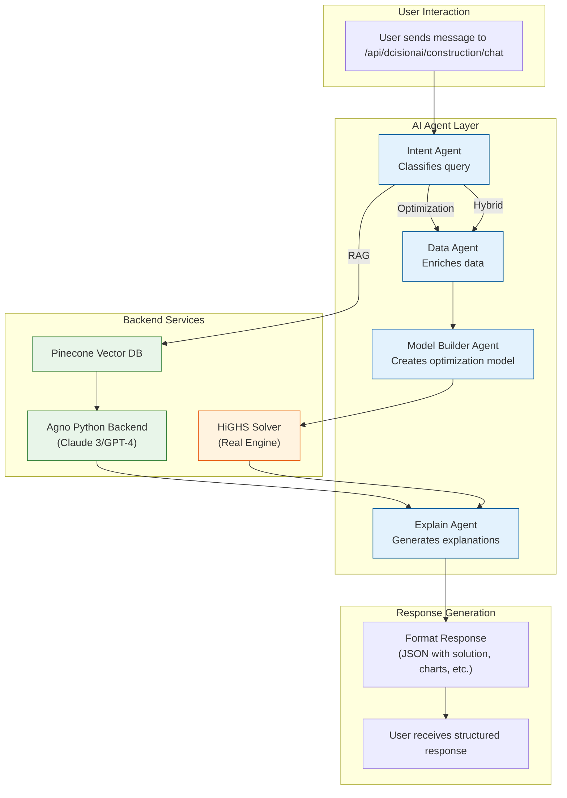

# DcisionAI Platform Architecture

## Overview

DcisionAI is a modern, cloud-native platform for construction optimization and decision-making. The platform provides a unified interface for solving complex construction problems using mathematical optimization techniques through the **Model Context Protocol (MCP)** framework and a sophisticated **multi-agent AI system**.

## System Architecture

```
┌─────────────────────────────────────────────────────────────────┐
│                    DcisionAI Platform                           │
│                                                                 │
│  ┌─────────────────────────────────────────────────────────┐   │
│  │                Next.js Application                      │   │
│  │                                                         │   │
│  │  ┌─────────────────┐  ┌─────────────────────────────────┐   │ │
│  │  │   Frontend UI   │  │        API Routes               │   │ │
│  │  │                 │  │                                 │   │ │
│  │  │ - Construction  │  │ - /api/solver/solve            │   │ │
│  │  │ - Retail        │  │ - /api/construction/chat       │   │ │
│  │  │ - Finance       │  │ - /api/retail/chat             │   │ │
│  │  │ - Chat Interface│  │ - /api/finance/chat            │   │ │
│  │  │ - Dashboard     │  │ - /api/rag/*                   │   │ │
│  │  │ - MCP Builder   │  │ - /api/mcp/*                   │   │ │
│  │  └─────────────────┘  └─────────────────────────────────┘   │ │
│  │                                                         │   │
│  │  ┌─────────────────────────────────────────────────────┐   │ │
│  │  │              AI Agent Layer                         │   │ │
│  │  │                                                     │   │ │
│  │  │ - Intent Agent (agnoIntentAgent)                   │   │ │
│  │  │ - Data Agent (agnoDataAgent)                       │   │ │
│  │  │ - Model Builder Agent (agnoModelBuilderAgent)      │   │ │
│  │  │ - Explain Agent (agnoExplainAgent)                 │   │ │
│  │  │ - Agno Python Backend Integration                  │   │ │
│  │  └─────────────────────────────────────────────────────┘   │ │
│  │                                                         │   │
│  │  ┌─────────────────────────────────────────────────────┐   │ │
│  │  │              MCP Layer                              │   │ │
│  │  │                                                     │   │ │
│  │  │ - MCP Assembly (assembleMCP.ts)                    │   │ │
│  │  │ - MCP Builder Components                            │   │ │
│  │  │ - Protocol Steps (Step1-6)                         │   │ │
│  │  │ - MCP Types & Validation                           │   │ │
│  │  └─────────────────────────────────────────────────────┘   │ │
│  │                                                         │   │
│  │  ┌─────────────────────────────────────────────────────┐   │ │
│  │  │              Solver Layer                           │   │ │
│  │  │                                                     │   │ │
│  │  │ - MCPSolverClient (HTTP/WebSocket)                 │   │ │
│  │  │ - MCPSolverManager (Multi-solver)                  │   │ │
│  │  │ - HiGHS (implemented - real engine)                │   │ │
│  │  │ - OR-Tools (placeholder)                           │   │ │
│  │  │ - Gurobi (placeholder)                             │   │ │
│  │  │ - CPLEX (placeholder)                              │   │ │
│  │  └─────────────────────────────────────────────────────┘   │ │
│  └─────────────────────────────────────────────────────────┘   │
│                                                                 │
│  ┌─────────────────────────────────────────────────────────┐   │
│  │                External Services                        │   │
│  │                                                         │   │
│  │  ┌─────────────────┐  ┌─────────────────────────────────┐   │ │
│  │  │   Agno Backend  │  │        Pinecone                │   │ │
│  │  │   (Python)      │  │                                 │   │ │
│  │  │                 │  │ - Vector Database              │   │ │
│  │  │ - Claude 3      │  │ - Knowledge Graph              │   │ │
│  │  │ - GPT-4         │  │ - RAG System                   │   │ │
│  │  │ - Agent Registry│  │                                 │   │ │
│  │  └─────────────────┘  └─────────────────────────────────┘   │ │
│  └─────────────────────────────────────────────────────────┘   │
└─────────────────────────────────────────────────────────────────┘
```

## Key Components

### 1. Frontend (Next.js)

**Location**: `src/pages/` and `src/components/`

- **Construction Workflow**: Project scheduling, resource allocation, cost optimization
- **Retail Workflow**: Inventory management, pricing optimization, demand forecasting
- **Finance Workflow**: Portfolio optimization, risk management, investment planning
- **Chat Interface**: AI-powered conversation interface for problem solving
- **Dashboard**: Real-time monitoring and analytics
- **MCP Builder**: Interactive Model Context Protocol creation interface

### 2. AI Agent Layer

**Location**: `src/pages/api/_lib/dcisionai-agents/`

The AI Agent Layer is the intelligence core of DcisionAI, providing specialized AI agents that work together to understand, process, and solve complex construction problems.

#### **Agent Architecture Overview**

```
┌─────────────────┐    ┌─────────────────┐    ┌─────────────────┐
│   Intent Agent  │───▶│   Data Agent    │───▶│ Model Builder   │
│                 │    │                 │    │     Agent       │
└─────────────────┘    └─────────────────┘    └─────────────────┘
         │                       │                       │
         ▼                       ▼                       ▼
┌─────────────────┐    ┌─────────────────┐    ┌─────────────────┐
│  Explain Agent  │    │   HiGHS Solver  │    │  Construction   │
│                 │    │   (Real Engine) │    │   Workflow      │
└─────────────────┘    └─────────────────┘    └─────────────────┘
```

#### **Agent Details**

##### **Intent Agent** (`agnoIntentAgent.ts`)
- **Purpose**: Analyzes user input to determine execution path
- **Capabilities**:
  - Classifies requests as RAG, Optimization, or Hybrid
  - Extracts keywords and confidence scores
  - Generates refined queries for knowledge base
  - Determines optimization problem descriptions
- **Output**: `{ decisionType, confidence, reasoning, ragQuery?, optimizationQuery?, keywords, primaryIntent }`
- **Integration**: Real Claude 3/GPT-4 via Agno backend

##### **Data Agent** (`agnoDataAgent.ts`)
- **Purpose**: Enriches customer data with construction-specific context
- **Capabilities**:
  - Analyzes raw project data
  - Extracts resources, timeline, costs, quality, and risks
  - Adds construction industry constraints
  - Validates data completeness
- **Output**: `{ enrichedData, constraints, metadata }`
- **Features**: Robust JSON parsing with fallback structures

##### **Model Builder Agent** (`agnoModelBuilderAgent.ts`)
- **Purpose**: Converts enriched data into mathematical optimization models
- **Capabilities**:
  - Creates MCP (Model Context Protocol) configurations
  - Defines variables, constraints, and objectives
  - Configures solver parameters
  - Handles different optimization problem types
- **Output**: `{ mcpConfig, confidence, reasoning }`
- **Integration**: MCP-compatible model generation

##### **Explain Agent** (`agnoExplainAgent.ts`)
- **Purpose**: Generates human-readable explanations of solutions
- **Capabilities**:
  - Explains RAG results with source attribution
  - Interprets optimization solutions
  - Provides actionable recommendations
  - Creates executive summaries
- **Output**: `{ summary, keyDecisions, recommendations, insights }`
- **Features**: Multi-format explanation (RAG, Optimization, Hybrid)

#### **Agent Workflow Integration**

The agents are orchestrated through the **Construction Workflow** (`constructionWorkflow.ts`):

```typescript
1. Intent Analysis → 2. Data Enrichment → 3. Model Building → 
4. Human Review (optional) → 5. Optimization Solving → 6. Explanation
```

**Key Features**:
- ✅ **Real-time Progress Tracking**: Live workflow progress updates
- ✅ **Error Handling & Retry Logic**: Robust error management with retry mechanisms
- ✅ **Session Management**: Persistent conversation context across agents
- ✅ **Memory Persistence**: Agent memory for context continuity
- ✅ **Human-in-the-Loop Support**: Optional human review steps

#### **Agno Backend Integration**

**Location**: `agno-backend/` and `src/pages/api/_lib/agno-client.ts`

- **Python FastAPI Backend**: Real AI model integration
- **TypeScript Client**: Clean interface to Python backend
- **Model Support**: Claude 3 (Haiku, Sonnet, Opus) and GPT-4
- **Agent Registry**: Persistent agent management
- **Session Management**: Conversation context persistence

### 3. API Layer

**Location**: `src/pages/api/`

- **Solver API** (`/api/solver/solve`): Optimization problem solving
- **Chat APIs**: Domain-specific chat endpoints for each workflow
- **RAG APIs**: Knowledge graph and document processing
- **MCP APIs**: Model Context Protocol management and execution
- **Authentication**: API key validation and rate limiting

### 4. MCP Layer

**Location**: `src/components/mcp/` and `src/pages/api/_lib/mcp/`

The Model Context Protocol (MCP) layer is the heart of DcisionAI's structured optimization approach:

#### **MCP Structure**
```typescript
interface MCP {
  id: string;
  sessionId: string;
  version: string;
  status: 'pending' | 'running' | 'completed' | 'failed';
  model: {
    variables: Variable[];
    constraints: Constraint[];
    objective: Objective;
  };
  context: {
    environment: { region: string; timezone: string; };
    dataset: { internalSources: string[]; dataQuality?: string; };
    problemType: string;
    industry: string;
  };
  protocol: {
    steps: Step[];
    allowPartialSolutions: boolean;
    explainabilityEnabled: boolean;
    humanInTheLoop: { required: boolean; };
  };
}
```

#### **MCP Builder Components**
- **Step1Intent.tsx**: Problem intent analysis and definition
- **Step2DataPrep.tsx**: Data preparation and enrichment
- **Step3ModelConstraints.tsx**: Model constraint definition
- **Step4PreviewMCP.tsx**: MCP preview and validation
- **Step5Explainability.tsx**: Explainability configuration
- **Step6Deploy.tsx**: MCP deployment and execution

#### **MCP Assembly**
- **assembleMCP.ts**: Core MCP assembly logic
- **MCPTypes.ts**: TypeScript type definitions
- **MCPBuilder**: Fluent interface for programmatic MCP creation

### 5. Solver Layer

**Location**: `src/pages/api/_lib/solvers/`

The solver layer provides mathematical optimization capabilities through MCP-compatible interfaces:

#### **HiGHS Solver Implementation**

**Location**: `src/pages/api/_lib/solvers/highs.ts`

The HiGHS solver is now **fully implemented** with real optimization capabilities:

##### **Real Implementation Features**
- ✅ **Actual HiGHS Process**: Spawns real HiGHS v1.11.0 process
- ✅ **MPS Format Support**: Converts problems to standard MPS format
- ✅ **Solution Parsing**: Reads real HiGHS solution files
- ✅ **Error Handling**: Comprehensive error management
- ✅ **Temporary File Management**: Automatic cleanup of temporary files

##### **Technical Implementation**
```typescript
export class HiGHSMCPSolver {
  // Real HiGHS process spawning
  private process = spawn('highs', ['--presolve', 'off']);
  
  // MPS format conversion
  private formatProblemToMPS(problem: any): string
  
  // Real solution parsing
  private parseHiGHSOutput(output: string, solutionFile?: string): HiGHSResult
  
  // Full optimization workflow
  async solve(problem: any): Promise<HiGHSResult>
}
```

##### **Problem Format Support**
- **Linear Programming (LP)**: Continuous variable optimization
- **Mixed-Integer Programming (MIP)**: Integer and binary variables
- **Constraint Types**: ≤, ≥, = constraints
- **Variable Bounds**: Lower and upper bounds
- **Objective Functions**: Minimize/Maximize linear objectives

##### **Solution Output**
```typescript
interface HiGHSResult {
  status: 'optimal' | 'infeasible' | 'unbounded' | 'time_limit';
  objective_value: number;
  solution: Array<{
    name: string;
    value: number;
    reduced_cost: number;
  }>;
  solve_time_ms: number;
  iterations: number;
}
```

#### **MCPSolverClient**
- **HTTP/WebSocket Support**: Multiple transport protocols
- **Multi-Solver Support**: HiGHS, OR-Tools, Gurobi, CPLEX
- **Connection Management**: Automatic connection handling
- **Error Handling**: Robust error recovery and retry logic

#### **MCPSolverManager**
- **Solver Orchestration**: Automatic solver selection and fallback
- **Performance Monitoring**: Solve time tracking and optimization
- **Health Checks**: Solver availability monitoring
- **Load Balancing**: Distributed solving across multiple solvers

| Solver | Status | License | Use Case | MCP Support | Implementation |
|--------|--------|---------|----------|-------------|----------------|
| **HiGHS** | ✅ Implemented | Open Source | Linear and mixed-integer programming | ✅ Full | Real engine with MPS format |
| **OR-Tools** | 🔄 Placeholder | Open Source | Constraint programming, routing | 🔄 Planned | Mock implementation |
| **Gurobi** | 🔄 Placeholder | Commercial | High-performance optimization | 🔄 Planned | Mock implementation |
| **CPLEX** | 🔄 Placeholder | Commercial | Enterprise optimization | 🔄 Planned | Mock implementation |

### 6. External Services

- **Agno Python Backend**: Real AI model integration (Claude 3, GPT-4)
- **Pinecone**: Vector database for knowledge graph and RAG system
- **Google Cloud Run**: Hosting and deployment platform

## Data Flow

### 1. Agent-Driven Workflow

```
User Input → Intent Agent → Data Agent → Model Builder Agent → 
HiGHS Solver → Explain Agent → Structured Response
```

### 2. MCP Creation Flow

```
User Input → MCP Builder UI → Step-by-Step Assembly → MCP Validation → Protocol Definition → Ready for Execution
```

### 3. MCP Execution Flow

```
MCP Definition → Protocol Steps → Solver Selection → Problem Solving → Results Analysis → Response Generation
```

### 4. Problem Solving Flow

```
User Input → Frontend → API Route → Agent Layer → MCP Layer → Solver Layer → External Solver → Solution → Frontend Display
```

### 5. Chat Flow

The chat interface provides a dynamic, intelligent layer for interacting with the DcisionAI platform. It uses a sophisticated routing mechanism to handle different types of user queries, from simple knowledge base questions to complex, hybrid optimization problems.



**Workflow Breakdown:**

1. **Query Classification**: The **Intent Agent** analyzes natural language to classify user intent into RAG, Optimization, or Hybrid categories.

2. **Data Processing**: The **Data Agent** enriches customer data with construction-specific context and constraints.

3. **Model Building**: The **Model Builder Agent** converts enriched data into mathematical optimization models (MCP format).

4. **Problem Solving**: The **HiGHS Solver** solves the optimization problem using real mathematical programming.

5. **Explanation**: The **Explain Agent** generates human-readable explanations with actionable insights.

6. **Response Generation**: Results are formatted into structured JSON with solutions, charts, and recommendations.

### 6. Knowledge Graph Flow

```
Document Upload → Text Extraction → OpenAI Embeddings → Pinecone Storage → RAG Query → Context Retrieval → MCP Enrichment
```

## MCP Protocol Steps

### Standard MCP Workflow

1. **Intent Analysis** (`Step1Intent.tsx`)
   - Problem type identification
   - Business objective definition
   - Constraint identification

2. **Data Preparation** (`Step2DataPrep.tsx`)
   - Data source integration
   - Data quality assessment
   - Feature engineering

3. **Model Constraints** (`Step3ModelConstraints.tsx`)
   - Variable definition
   - Constraint formulation
   - Objective function setup

4. **MCP Preview** (`Step4PreviewMCP.tsx`)
   - Protocol validation
   - Model verification
   - Execution preview

5. **Explainability** (`Step5Explainability.tsx`)
   - Solution interpretation
   - Sensitivity analysis
   - Decision rationale

6. **Deployment** (`Step6Deploy.tsx`)
   - MCP execution
   - Result delivery
   - Performance monitoring

## Technology Stack

### Frontend
- **Next.js 14**: React framework with server-side rendering
- **TypeScript**: Type-safe JavaScript
- **Tailwind CSS**: Utility-first CSS framework
- **React Hook Form**: Form handling
- **React Query**: Data fetching and caching

### Backend
- **Node.js**: JavaScript runtime
- **Express**: Web framework (via Next.js API routes)
- **Python FastAPI**: Agno backend for AI model integration
- **Mathematical Optimization**: HiGHS (real), OR-Tools, Gurobi, CPLEX
- **MCP Framework**: Model Context Protocol implementation

### AI & ML
- **Claude 3**: Anthropic's latest AI models (Haiku, Sonnet, Opus)
- **GPT-4**: OpenAI's advanced language model
- **Multi-Agent System**: Specialized AI agents for different tasks
- **RAG System**: Retrieval-Augmented Generation for knowledge queries

### Infrastructure
- **Google Cloud Run**: Serverless container platform
- **Google Cloud Build**: CI/CD pipeline
- **Docker**: Containerization
- **Pinecone**: Vector database
- **Agno Backend**: Python FastAPI service for AI integration

## Deployment Architecture

```
┌─────────────────────────────────────────────────────────┐
│                Google Cloud Platform                    │
│                                                         │
│  ┌─────────────────────────────────────────────────────┐ │
│  │              Cloud Run Service                      │ │
│  │                                                     │ │
│  │  ┌─────────────────────────────────────────────────┐ │ │
│  │  │            Next.js Container                    │ │ │
│  │  │                                                 │ │ │
│  │  │ - Frontend UI                                   │ │ │
│  │  │ - API Routes                                    │ │ │
│  │  │ - AI Agent Layer                                │ │ │
│  │  │ - MCP Layer                                     │ │ │
│  │  │ - Solver Layer                                  │ │ │
│  │  │ - Static Assets                                 │ │ │
│  │  └─────────────────────────────────────────────────┘ │ │
│  └─────────────────────────────────────────────────────┘ │
│                                                         │
│  ┌─────────────────────────────────────────────────────┐ │
│  │              Agno Backend Service                   │ │
│  │                                                     │ │
│  │  ┌─────────────────────────────────────────────────┐ │ │
│  │  │            Python FastAPI                       │ │ │
│  │  │                                                 │ │ │
│  │  │ - Claude 3 Integration                          │ │ │
│  │  │ - GPT-4 Integration                             │ │ │
│  │  │ - Agent Registry                                │ │ │
│  │  │ - Session Management                            │ │ │
│  │  └─────────────────────────────────────────────────┘ │ │
│  └─────────────────────────────────────────────────────┘ │
│                                                         │
│  ┌─────────────────────────────────────────────────────┐ │
│  │              External Services                      │ │
│  │                                                     │ │
│  │  ┌─────────────────┐  ┌─────────────────────────────┐ │ │
│  │  │   Pinecone      │  │        HiGHS Solver        │ │ │
│  │  │                 │  │                             │ │ │
│  │  │ - Vector DB     │  │ - Local Process             │ │ │
│  │  │ - Knowledge     │  │ - MPS Format                │ │ │
│  │  │   Graph         │  │ - Real Optimization         │ │ │
│  │  └─────────────────┘  └─────────────────────────────┘ │ │
│  └─────────────────────────────────────────────────────┘ │
└─────────────────────────────────────────────────────────┘
```

## Security

- **API Key Authentication**: Secure access to solver endpoints
- **Rate Limiting**: Protection against abuse
- **CORS Configuration**: Cross-origin request handling
- **Environment Variables**: Secure configuration management
- **MCP Validation**: Protocol integrity verification
- **Agent Isolation**: Secure agent communication channels

## Scalability

- **Horizontal Scaling**: Cloud Run automatically scales based on demand
- **Stateless Design**: No session state, easy scaling
- **CDN Integration**: Static assets served via CDN
- **Database Optimization**: Efficient vector search and caching
- **MCP Caching**: Protocol definition caching for performance
- **Agent Pooling**: Multiple agent instances for high availability

## Monitoring and Observability

- **Google Cloud Logging**: Centralized log management
- **Error Tracking**: Comprehensive error reporting
- **Performance Monitoring**: Response time and throughput metrics
- **Health Checks**: Automated service health monitoring
- **MCP Analytics**: Protocol execution tracking and optimization
- **Agent Metrics**: AI agent performance and accuracy tracking

## Future Enhancements

1. **Additional Solvers**: Implement OR-Tools, Gurobi, and CPLEX with full MCP support
2. **Real-time Collaboration**: Multi-user MCP building and execution
3. **Advanced Analytics**: Predictive modeling and insights
4. **Mobile Support**: Progressive web app capabilities
5. **Enterprise Features**: SSO, advanced permissions, audit trails
6. **MCP Marketplace**: Community-driven protocol sharing and reuse
7. **Agent Specialization**: Domain-specific agent training and optimization
8. **Multi-Modal AI**: Image and document processing capabilities 