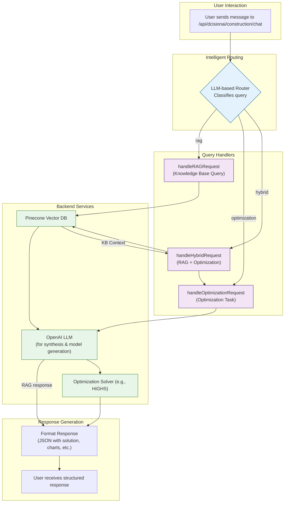

# DcisionAI Platform Architecture

## Overview

DcisionAI is a modern, cloud-native platform for construction optimization and decision-making. The platform provides a unified interface for solving complex construction problems using mathematical optimization techniques through the **Model Context Protocol (MCP)** framework.

## System Architecture

```
┌─────────────────────────────────────────────────────────────────┐
│                    DcisionAI Platform                           │
│                                                                 │
│  ┌─────────────────────────────────────────────────────────┐   │
│  │                Next.js Application                      │   │
│  │                                                         │   │
│  │  ┌─────────────────┐  ┌─────────────────────────────────┐   │ │
│  │  │   Frontend UI   │  │        API Routes               │   │ │
│  │  │                 │  │                                 │   │ │
│  │  │ - Construction  │  │ - /api/solver/solve            │   │ │
│  │  │ - Retail        │  │ - /api/construction/chat       │   │ │
│  │  │ - Finance       │  │ - /api/retail/chat             │   │ │
│  │  │ - Chat Interface│  │ - /api/finance/chat            │   │ │
│  │  │ - Dashboard     │  │ - /api/rag/*                   │   │ │
│  │  │ - MCP Builder   │  │ - /api/mcp/*                   │   │ │
│  │  └─────────────────┘  └─────────────────────────────────┘   │ │
│  │                                                         │   │
│  │  ┌─────────────────────────────────────────────────────┐   │ │
│  │  │              MCP Layer                              │   │ │
│  │  │                                                     │   │ │
│  │  │ - MCP Assembly (assembleMCP.ts)                    │   │ │
│  │  │ - MCP Builder Components                            │   │ │
│  │  │ - Protocol Steps (Step1-6)                         │   │ │
│  │  │ - MCP Types & Validation                           │   │ │
│  │  └─────────────────────────────────────────────────────┘   │ │
│  │                                                         │   │
│  │  ┌─────────────────────────────────────────────────────┐   │ │
│  │  │              Solver Layer                           │   │ │
│  │  │                                                     │   │ │
│  │  │ - MCPSolverClient (HTTP/WebSocket)                 │   │ │
│  │  │ - MCPSolverManager (Multi-solver)                  │   │ │
│  │  │ - HiGHS (implemented - mock)                       │   │ │
│  │  │ - OR-Tools (placeholder)                           │   │ │
│  │  │ - Gurobi (placeholder)                             │   │ │
│  │  │ - CPLEX (placeholder)                              │   │ │
│  │  └─────────────────────────────────────────────────────┘   │ │
│  └─────────────────────────────────────────────────────────┘   │
│                                                                 │
│  ┌─────────────────────────────────────────────────────────┐   │
│  │                External Services                        │   │
│  │                                                         │   │
│  │  ┌─────────────────┐  ┌─────────────────────────────────┐   │ │
│  │  │   OpenAI API    │  │        Pinecone                │   │ │
│  │  │                 │  │                                 │   │ │
│  │  │ - GPT-4         │  │ - Vector Database              │   │ │
│  │  │ - Embeddings    │  │ - Knowledge Graph              │   │ │
│  │  │ - Chat Completions│ │ - RAG System                   │   │ │
│  │  └─────────────────┘  └─────────────────────────────────┘   │ │
│  └─────────────────────────────────────────────────────────┘   │
└─────────────────────────────────────────────────────────────────┘
```

## Key Components

### 1. Frontend (Next.js)

**Location**: `src/pages/` and `src/components/`

- **Construction Workflow**: Project scheduling, resource allocation, cost optimization
- **Retail Workflow**: Inventory management, pricing optimization, demand forecasting
- **Finance Workflow**: Portfolio optimization, risk management, investment planning
- **Chat Interface**: AI-powered conversation interface for problem solving
- **Dashboard**: Real-time monitoring and analytics
- **MCP Builder**: Interactive Model Context Protocol creation interface

### 2. API Layer

**Location**: `src/pages/api/`

- **Solver API** (`/api/solver/solve`): Optimization problem solving
- **Chat APIs**: Domain-specific chat endpoints for each workflow
- **RAG APIs**: Knowledge graph and document processing
- **MCP APIs**: Model Context Protocol management and execution
- **Authentication**: API key validation and rate limiting

### 3. MCP Layer

**Location**: `src/components/mcp/` and `src/pages/api/_lib/mcp/`

The Model Context Protocol (MCP) layer is the heart of DcisionAI's structured optimization approach:

#### **MCP Structure**
```typescript
interface MCP {
  id: string;
  sessionId: string;
  version: string;
  status: 'pending' | 'running' | 'completed' | 'failed';
  model: {
    variables: Variable[];
    constraints: Constraint[];
    objective: Objective;
  };
  context: {
    environment: { region: string; timezone: string; };
    dataset: { internalSources: string[]; dataQuality?: string; };
    problemType: string;
    industry: string;
  };
  protocol: {
    steps: Step[];
    allowPartialSolutions: boolean;
    explainabilityEnabled: boolean;
    humanInTheLoop: { required: boolean; };
  };
}
```

#### **MCP Builder Components**
- **Step1Intent.tsx**: Problem intent analysis and definition
- **Step2DataPrep.tsx**: Data preparation and enrichment
- **Step3ModelConstraints.tsx**: Model constraint definition
- **Step4PreviewMCP.tsx**: MCP preview and validation
- **Step5Explainability.tsx**: Explainability configuration
- **Step6Deploy.tsx**: MCP deployment and execution

#### **MCP Assembly**
- **assembleMCP.ts**: Core MCP assembly logic
- **MCPTypes.ts**: TypeScript type definitions
- **MCPBuilder**: Fluent interface for programmatic MCP creation

### 4. Solver Layer

**Location**: `src/pages/api/_lib/solvers/`

The solver layer provides mathematical optimization capabilities through MCP-compatible interfaces:

#### **MCPSolverClient**
- **HTTP/WebSocket Support**: Multiple transport protocols
- **Multi-Solver Support**: HiGHS, OR-Tools, Gurobi, CPLEX
- **Connection Management**: Automatic connection handling
- **Error Handling**: Robust error recovery and retry logic

#### **MCPSolverManager**
- **Solver Orchestration**: Automatic solver selection and fallback
- **Performance Monitoring**: Solve time tracking and optimization
- **Health Checks**: Solver availability monitoring
- **Load Balancing**: Distributed solving across multiple solvers

| Solver | Status | License | Use Case | MCP Support |
|--------|--------|---------|----------|-------------|
| **HiGHS** | ✅ Implemented | Open Source | Linear and mixed-integer programming | ✅ Full |
| **OR-Tools** | 🔄 Placeholder | Open Source | Constraint programming, routing | 🔄 Planned |
| **Gurobi** | 🔄 Placeholder | Commercial | High-performance optimization | 🔄 Planned |
| **CPLEX** | 🔄 Placeholder | Commercial | Enterprise optimization | 🔄 Planned |

### 5. External Services

- **OpenAI API**: GPT-4 for natural language processing and problem understanding
- **Pinecone**: Vector database for knowledge graph and RAG system
- **Google Cloud Run**: Hosting and deployment platform

## Data Flow

### 1. MCP Creation Flow

```
User Input → MCP Builder UI → Step-by-Step Assembly → MCP Validation → Protocol Definition → Ready for Execution
```

### 2. MCP Execution Flow

```
MCP Definition → Protocol Steps → Solver Selection → Problem Solving → Results Analysis → Response Generation
```

### 3. Problem Solving Flow

```
User Input → Frontend → API Route → MCP Layer → Solver Layer → External Solver → Solution → Frontend Display
```

### 4. Chat Flow

The chat interface provides a dynamic, intelligent layer for interacting with the DcisionAI platform. It uses a sophisticated routing mechanism to handle different types of user queries, from simple knowledge base questions to complex, hybrid optimization problems.



**Workflow Breakdown:**

1.  **Query Classification**: When a user sends a message, it's first processed by an **LLM-based router**. This router analyzes the natural language to classify the user's intent into one of three categories:
    *   `rag`: A request for information from the knowledge base.
    *   `optimization`: A request to solve a mathematical optimization problem.
    *   `hybrid`: A request that requires both knowledge retrieval and optimization.

2.  **Request Handling**: Based on the classification, the request is passed to the appropriate handler:
    *   **`handleRAGRequest`**: For `rag` queries, this function generates embeddings from the user's message, queries the **Pinecone vector database** to find relevant documents, and uses an LLM to synthesize a natural language answer from the retrieved context.
    *   **`handleOptimizationRequest`**: For `optimization` queries, this function uses a powerful LLM (e.g., GPT-4) with a carefully engineered prompt to convert the user's natural language request into a structured JSON optimization problem. This problem is then passed to the appropriate **optimization solver** (e.g., HiGHS).
    *   **`handleHybridRequest`**: For `hybrid` queries, this function first performs a RAG query to retrieve relevant context from the knowledge base. This context is then injected into the prompt for the optimization model, allowing the AI to generate a more informed and context-aware optimization problem.

3.  **Response Generation**: The final output from the handler is formatted into a structured JSON object containing the solution, analysis, visualizations (like Mermaid charts), and a summary, which is then sent back to the user.

### 5. Knowledge Graph Flow

```
Document Upload → Text Extraction → OpenAI Embeddings → Pinecone Storage → RAG Query → Context Retrieval → MCP Enrichment
```

## MCP Protocol Steps

### Standard MCP Workflow

1. **Intent Analysis** (`Step1Intent.tsx`)
   - Problem type identification
   - Business objective definition
   - Constraint identification

2. **Data Preparation** (`Step2DataPrep.tsx`)
   - Data source integration
   - Data quality assessment
   - Feature engineering

3. **Model Constraints** (`Step3ModelConstraints.tsx`)
   - Variable definition
   - Constraint formulation
   - Objective function setup

4. **MCP Preview** (`Step4PreviewMCP.tsx`)
   - Protocol validation
   - Model verification
   - Execution preview

5. **Explainability** (`Step5Explainability.tsx`)
   - Solution interpretation
   - Sensitivity analysis
   - Decision rationale

6. **Deployment** (`Step6Deploy.tsx`)
   - MCP execution
   - Result delivery
   - Performance monitoring

## Technology Stack

### Frontend
- **Next.js 14**: React framework with server-side rendering
- **TypeScript**: Type-safe JavaScript
- **Tailwind CSS**: Utility-first CSS framework
- **React Hook Form**: Form handling
- **React Query**: Data fetching and caching

### Backend
- **Node.js**: JavaScript runtime
- **Express**: Web framework (via Next.js API routes)
- **Mathematical Optimization**: HiGHS, OR-Tools, Gurobi, CPLEX
- **MCP Framework**: Model Context Protocol implementation

### Infrastructure
- **Google Cloud Run**: Serverless container platform
- **Google Cloud Build**: CI/CD pipeline
- **Docker**: Containerization
- **Pinecone**: Vector database
- **OpenAI API**: AI services

## Deployment Architecture

```
┌─────────────────────────────────────────────────────────┐
│                Google Cloud Platform                    │
│                                                         │
│  ┌─────────────────────────────────────────────────────┐ │
│  │              Cloud Run Service                      │ │
│  │                                                     │ │
│  │  ┌─────────────────────────────────────────────────┐ │ │
│  │  │            Next.js Container                    │ │ │
│  │  │                                                 │ │ │
│  │  │ - Frontend UI                                   │ │ │
│  │  │ - API Routes                                    │ │ │
│  │  │ - MCP Layer                                     │ │ │
│  │  │ - Solver Layer                                  │ │ │
│  │  │ - Static Assets                                 │ │ │
│  │  └─────────────────────────────────────────────────┘ │ │
│  └─────────────────────────────────────────────────────┘ │
│                                                         │
│  ┌─────────────────────────────────────────────────────┐ │
│  │              External Services                      │ │
│  │                                                     │ │
│  │  ┌─────────────────┐  ┌─────────────────────────────┐ │ │
│  │  │   OpenAI API    │  │        Pinecone             │ │ │
│  │  └─────────────────┘  └─────────────────────────────┘ │ │
│  └─────────────────────────────────────────────────────┘ │
└─────────────────────────────────────────────────────────┘
```

## Security

- **API Key Authentication**: Secure access to solver endpoints
- **Rate Limiting**: Protection against abuse
- **CORS Configuration**: Cross-origin request handling
- **Environment Variables**: Secure configuration management
- **MCP Validation**: Protocol integrity verification

## Scalability

- **Horizontal Scaling**: Cloud Run automatically scales based on demand
- **Stateless Design**: No session state, easy scaling
- **CDN Integration**: Static assets served via CDN
- **Database Optimization**: Efficient vector search and caching
- **MCP Caching**: Protocol definition caching for performance

## Monitoring and Observability

- **Google Cloud Logging**: Centralized log management
- **Error Tracking**: Comprehensive error reporting
- **Performance Monitoring**: Response time and throughput metrics
- **Health Checks**: Automated service health monitoring
- **MCP Analytics**: Protocol execution tracking and optimization

## Future Enhancements

1. **Additional Solvers**: Implement OR-Tools, Gurobi, and CPLEX with full MCP support
2. **Real-time Collaboration**: Multi-user MCP building and execution
3. **Advanced Analytics**: Predictive modeling and insights
4. **Mobile Support**: Progressive web app capabilities
5. **Enterprise Features**: SSO, advanced permissions, audit trails
6. **MCP Marketplace**: Community-driven protocol sharing and reuse 