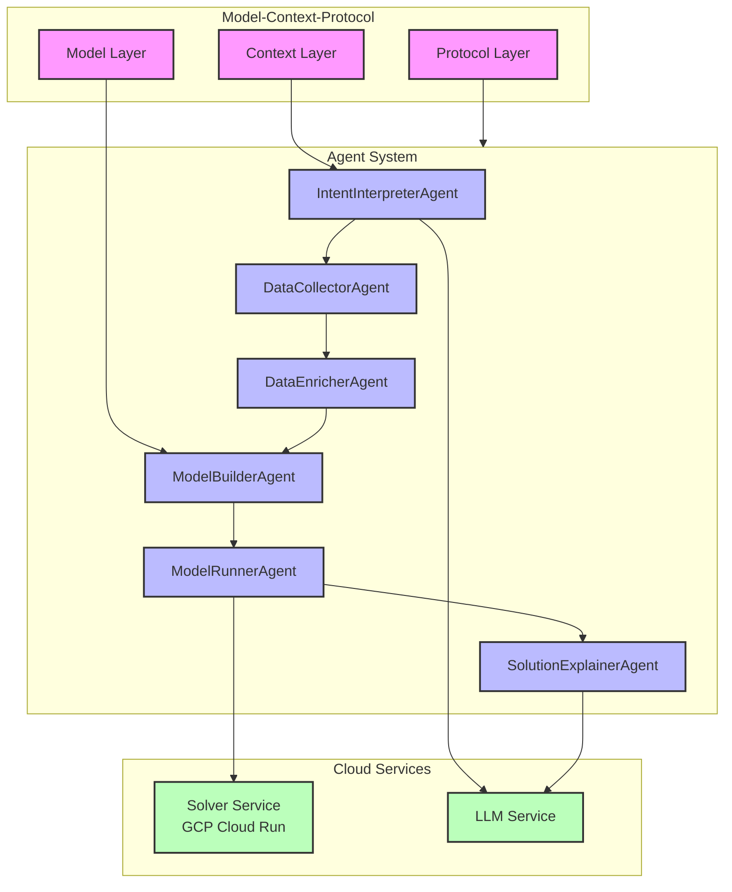

# MCP Architecture Diagram

## Architecture Flow

1. **MCP Layer**
   - Model: Defines optimization problem structure
   - Context: Provides runtime and domain context
   - Protocol: Specifies execution flow

2. **Agent System**
   - IntentInterpreterAgent: Understands problem requirements
   - DataCollectorAgent: Gathers required data
   - DataEnricherAgent: Enhances data
   - ModelBuilderAgent: Constructs optimization model
   - ModelRunnerAgent: Executes solver
   - SolutionExplainerAgent: Explains results

3. **Cloud Services**
   - Solver Service: GCP Cloud Run deployment
   - LLM Service: Natural language processing

## Integration Points

1. **MCP to Agents**
   - Model data flows to ModelBuilderAgent
   - Context informs IntentInterpreterAgent
   - Protocol guides agent execution

2. **Agent to Cloud**
   - ModelRunnerAgent calls Solver Service
   - Intent and Solution agents use LLM
   - Cloud services provide scalability

## Key Features

1. **Modular Design**
   - Independent agent components
   - Clear separation of concerns
   - Easy to extend and modify

2. **Cloud Native**
   - Scalable solver service
   - Managed infrastructure
   - Secure communication

3. **LLM Integration**
   - Natural language understanding
   - Solution explanation
   - Business context 