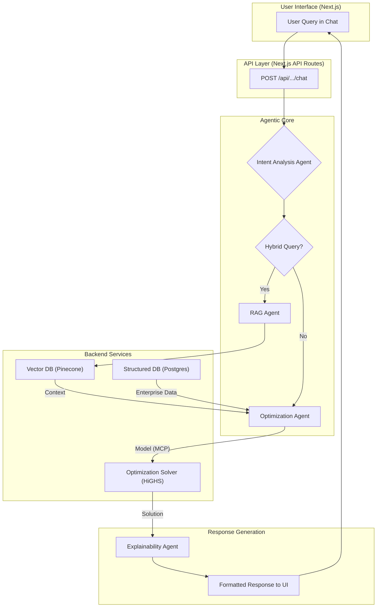

### **Technical Due Diligence Report: DcisionAI Platform**

**To:** Investment Committee
**From:** Lead Technical Diligence Analyst
**Date:** Jun 22, 2025
**Subject:** Assessment of the DcisionAI Multi-Agent Platform for Seed/Series A Investment

---

#### **1. Executive Summary**

The DcisionAI platform represents a sophisticated and well-architected system designed to address a clear market need: vertical-specific, AI-driven decision optimization. The architecture is modern, leveraging a robust technology stack (Next.js, TypeScript, Python) and cutting-edge AI paradigms (agentic workflows, RAG, formal optimization).

The platform's core intellectual property lies in its **Model Context Protocol (MCP)** and the **intelligent agent-based workflow** that orchestrates complex tasks. This is not merely a thin wrapper around a Large Language Model (LLM); it is a structured, extensible, and defensible system for translating natural language intent into auditable, optimized business decisions.

**Recent Innovation: GPT-4o-mini Integration**
The platform has recently been enhanced with GPT-4o-mini integration for the Enhanced Model Builder, providing significant performance and cost benefits (2x faster, 60x cheaper than GPT-4o) while maintaining excellent mathematical reasoning capabilities. This multi-strategy approach combines dynamic AI generation, template-based fallback, and AI-generated fallback for robust optimization model creation.

While the platform is currently in a growth stage, its foundational architecture is sound and demonstrates a clear path to scalability. The areas identified for future consideration are typical of a platform at this stage and represent a well-understood engineering roadmap rather than fundamental architectural flaws. From a technical standpoint, DcisionAI is well-positioned for future growth and represents a compelling investment opportunity.

---

#### **2. Core Innovation & Technical Moat**

The primary defensibility of the DcisionAI platform stems from the synergy of two key concepts:

*   **Model Context Protocol (MCP):** This is the platform's "lingua franca." The MCP is a standardized JSON structure that serves as the canonical representation of a decision problem as it moves through the system. It includes sections for user intent, data context, model variables, constraints, and objectives. This structured approach is a significant advantage, providing:
    *   **Auditability:** Every step of the decision process is captured in a predictable format.
    *   **Interoperability:** Different agents (written in potentially different languages) can operate on the same problem context without ambiguity.
    *   **Extensibility:** Adding new capabilities (e.g., a new type of constraint, a new solver) becomes a matter of extending the protocol, not rewriting agent logic.

*   **Agentic AI Workflow:** The platform employs a multi-agent system to deconstruct and solve problems. An incoming natural language query is not sent to a monolithic service. Instead, it is routed through a series of specialized agents:
    1.  **Intent Agent:** Classifies the user's goal (e.g., Request for Information, Optimization Problem, Hybrid Query).
    2.  **Data Agent / RAG Agent:** If information is needed, this agent queries the vectorized knowledge base (Pinecone) to retrieve relevant context.
    3.  **Enhanced Model Builder Agent:** Uses GPT-4o-mini to dynamically generate optimization models from user input and enriched data, with intelligent fallback strategies.
    4.  **Solver Agent:** Takes the completed MCP and passes it to a dedicated optimization engine (e.g., HiGHS).
    5.  **Explain Agent:** Interprets the solver's raw output and presents it back to the user in a natural, understandable format.

**Enhanced Model Builder Innovation:**
The platform's Model Builder Agent has been significantly enhanced with a multi-strategy approach:
- **Dynamic AI Generation:** Uses GPT-4o-mini to generate optimization models from natural language descriptions and enriched data
- **Template-Based Fallback:** Falls back to pre-built optimization templates when AI generation fails
- **AI-Generated Fallback:** Creates simple but valid models using AI when templates aren't suitable
- **Configuration Management:** Centralized system for switching between different AI models and providers

This modular, agent-based routing is the platform's "brain." It allows for a powerful combination of generative AI (for understanding and explaining) and formal, deterministic systems (for optimization), creating a solution that is both intelligent and reliable.

#### **3. Architecture & System Design**

Here is a diagram illustrating the intelligent chat flow, which is the heart of the platform's innovation.

This diagram visualizes the flow described above. The architecture demonstrates a strong separation of concerns:

*   **Frontend:** A modern React/Next.js application provides a responsive and dynamic user interface. The use of components is logical and promotes reusability.
*   **API Layer:** Leveraging Next.js API routes provides a unified codebase for both front-end and back-end logic, simplifying development and deployment. The API structure (`/api/rag`, `/api/solver`, etc.) is clean and resource-oriented.
*   **Data Layer:** The platform intelligently uses different database types for their intended purpose:
    *   **Supabase/Postgres:** For structured user data, accounts, and API keys. The use of Row-Level Security (RLS) is a strong indicator of security maturity.
    *   **Pinecone:** For high-performance vector search, which is essential for the RAG functionality.
*   **Solver Integration:** The integration with the HiGHS solver is well-encapsulated, allowing for other solvers to be added in the future with minimal disruption.

#### **4. Strengths & Opportunities**

*   **Strong Technical Foundation:** The choice of TypeScript enforces type safety, which significantly reduces runtime errors and improves code maintainability. The codebase is well-organized and follows modern development patterns.
*   **Extensibility:** The agentic architecture is inherently extensible. New vertical industries can be targeted by creating new, specialized prompts for the agents and adding domain-specific knowledge bases. New tools (e.g., a new data visualization library, another solver) can be added as new "skills" for the agents to use.
*   **Scalability Path:** While the current single-service Next.js deployment is efficient, the architecture is primed for evolution. The `agno-backend` and various Dockerfiles indicate foresight in separating the computationally intensive solver workloads into dedicated microservices as demand grows. This would allow the core web application and the solver service to be scaled independently.
*   **Developer Experience:** The project is well-structured with clear directories, scripts for deployment (`/scripts`), and infrastructure-as-code (`/terraform`), which indicates a mature approach to development operations (DevOps).

#### **5. Areas for Consideration & Future Roadmap**

These are not immediate concerns but represent the natural evolution for a production-grade enterprise platform:

*   **Observability:** For a system this complex, comprehensive logging, tracing, and metrics are paramount. While some metric endpoints exist, a production deployment would require structured logging across all agents to trace a query's journey through the system. This is crucial for debugging and performance monitoring.
*   **Testing Rigor:** The platform would benefit from a more comprehensive testing suite. This includes end-to-end tests for critical user flows (e.g., a full RAG+Optimization query) and more robust integration tests between agents to validate the handoffs within the MCP.
*   **CI/CD Automation:** While deployment scripts exist, fully automating the testing and deployment pipeline (CI/CD) will be essential to ensure reliability and development velocity as the team grows.
*   **Solver Service Decoupling:** As mentioned, formalizing the plan to decouple the solver into its own auto-scaling service will be a key step towards handling enterprise-level workloads and managing computational costs effectively.

#### **6. Conclusion & Recommendation**

The DcisionAI platform is built on a solid and defensible technical foundation. The team has made intelligent technology choices and has designed a system that is both innovative and practical. The core IP, embodied by the MCP and the agentic workflow, provides a distinct competitive advantage over generic AI solutions.

The identified risks and areas for consideration are manageable and represent a standard engineering roadmap for a company at this stage.

**Recommendation:** **Approve.** The technology is sound, scalable, and well-aligned with the company's ambitious vision. The platform is a strong candidate for investment. 