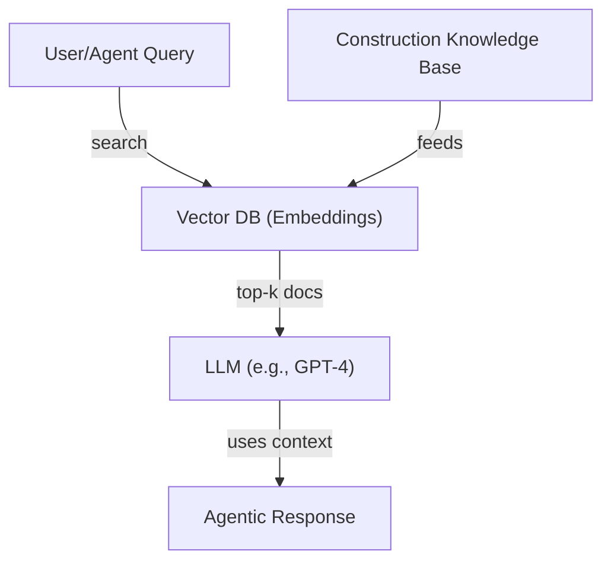

# Construction Agent: LLM-Powered Knowledge Base for Construction Management

## Key Decision Areas for Construction Companies
- **Project Planning & Scheduling:** Task breakdown, dependencies, timelines, resource allocation.
- **Resource Management:** Labor, equipment, materials, subcontractors.
- **Cost Estimation & Budgeting:** Bids, procurement, cost tracking, change orders.
- **Risk Management:** Safety, compliance, weather, supply chain disruptions.
- **Quality Control:** Inspections, standards, documentation.
- **Contract Management:** Legal, claims, payments, documentation.
- **Logistics & Supply Chain:** Delivery schedules, inventory, site layout.
- **Sustainability & Compliance:** Environmental, regulatory, reporting.
- **Communication & Collaboration:** Stakeholder updates, RFIs, meeting notes.

## What Should the Knowledge Base Contain?
- **Industry Standards & Best Practices:** PMBOK, Lean, BIM, OSHA, etc.
- **Company Policies & Templates:** Custom procedures, forms, checklists.
- **Historical Project Data:** Lessons learned, past schedules, cost data.
- **External Data:** Weather, regulations, supplier catalogs.
- **FAQs & How-Tos:** Common questions, troubleshooting, workflows.

## How to Build a Knowledge Base for LLM Agents (Current State)

### A. Data Collection & Organization
- Gather documents: PDFs, DOCs, spreadsheets, emails, manuals, contracts, etc.
- Structure them: Tag by topic, type, and decision area.
- Convert to text/markdown for easy ingestion.

### B. Embedding & Indexing
- Use an embedding model (e.g., OpenAI, Cohere, or open-source) to convert documents into vector representations.
- Store vectors in a vector database (e.g., Pinecone, Weaviate, Chroma, or Elasticsearch).

### C. Retrieval-Augmented Generation (RAG)
- When an agent receives a query, use semantic search to retrieve the most relevant knowledge base chunks.
- Pass these chunks as context to the LLM (e.g., GPT-4, Claude, etc.) to generate answers grounded in your knowledge base.

### D. Agent Integration
- Each agent (Intent, Data, Model Build, Explainability) can query the knowledge base as part of its workflow.
- Example: The Intent Agent can clarify user goals using best practices; the Model Build Agent can reference historical optimization templates.

## How to Implement This in Your Platform
- **Knowledge Tab:** Allow users to upload documents (CSV, PDF, DOCX, etc.) and tag them.
- **Backend:** On upload, extract text, chunk it, embed it, and store in your vector DB.
- **Agent API:** Expose endpoints for agents to query the knowledge base (e.g., `/api/knowledge/search`).
- **RAG Pipeline:** For every agent LLM call, retrieve relevant context from the knowledge base and include it in the prompt.

## Future State: Custom LLM
- **Domain-Specific Pretraining:** Fine-tune or pretrain an LLM on your curated construction data.
- **Continuous Learning:** Use feedback from agent interactions to improve the model.
- **Advanced Reasoning:** Enable multi-step, tool-using, and multi-agent workflows.

## Example: Current State RAG Pipeline

## Next Steps for Your Platform
1. Set up a vector DB (Pinecone, Weaviate, etc.).
2. Build a document ingestion pipeline (extract, chunk, embed, store).
3. Expose a semantic search API for your agents.
4. Integrate RAG into agent LLM calls.
5. Iterate with real construction data and user feedback. 

flowchart TD
    UserQuery["User/Agent Query"]
    VectorDB["Pinecone (Embeddings)"]
    LLM["LLM (e.g., GPT-4)"]
    KnowledgeBase["Construction Knowledge Base"]
    Response["Agentic Response"]

    UserQuery --search--> VectorDB
    VectorDB --top-k docs--> LLM
    LLM --uses context--> Response
    KnowledgeBase --feeds--> VectorDB