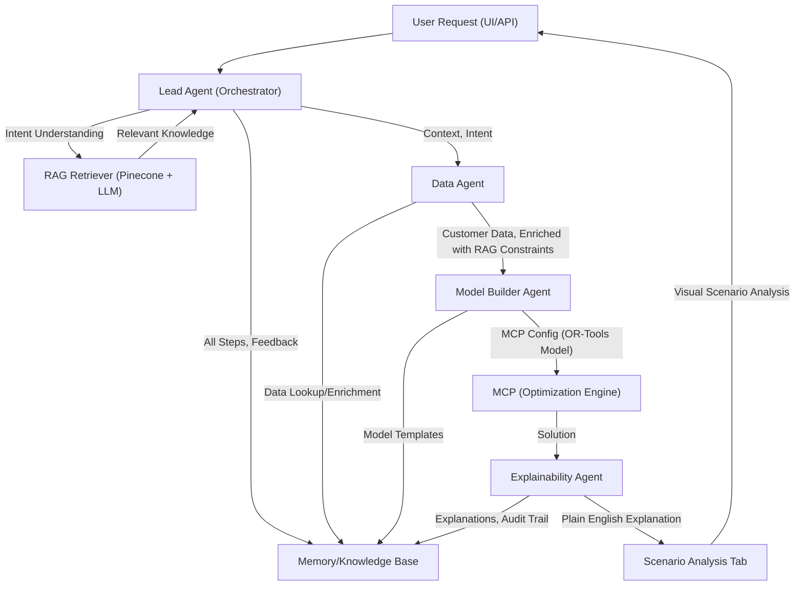

# DcisionAI Construction Agent Architecture


---

## Overview
This document describes the end-to-end architecture for the DcisionAI Construction Agent, which leverages Retrieval-Augmented Generation (RAG), agent orchestration, and scenario analysis to deliver transparent, auditable, and human-in-the-loop optimization for construction management decisions.

---

## Architecture Diagram



---

## Agent Roles and Workflow

### 1. **Lead Agent (Orchestrator)**
- Understands user intent and decision context.
- Queries the RAG Retriever to gather relevant construction knowledge (industry standards, best practices, etc.).
- Passes context and intent to downstream agents.

### 2. **RAG Retriever**
- Uses Pinecone and LLM to retrieve relevant knowledge base chunks for the current decision.
- Provides context to the Lead Agent for grounding and transparency.

### 3. **Data Agent**
- Looks up customer-uploaded data (e.g., project files, CSVs).
- Enriches this data with RAG-driven constraints and best practices.
- Prepares a unified context for modeling.

### 4. **Model Builder Agent**
- Builds an OR-Tools compatible optimization model based on the enriched context and user intent.
- Outputs an MCP config (see below) that encodes the optimization problem.

### 5. **MCP (Optimization Engine)**
- Receives the MCP config and runs the optimization model.
- Returns the solution to the agent pipeline.

### 6. **Explainability Agent**
- Translates the solver's decision into plain English for transparency and auditability.
- Supports human-in-the-loop workflows and value propositions.

### 7. **Scenario Analysis Tab**
- Allows customers to visually run and compare scenarios for the given decision.
- Integrates explanations, data, and optimization results for decision support.

### 8. **Memory/Knowledge Base**
- Stores all steps, feedback, explanations, and audit trails for continuous improvement and compliance.

---

## Sample MCP Config Structure

```json
{
  "sessionId": "test-fleetops-001",
  "model": {
    "variables": [ ... ],
    "constraints": [ ... ],
    "objective": { ... }
  },
  "context": {
    "environment": { ... },
    "dataset": { ... },
    "problemType": "vehicle_routing",
    "industry": "logistics"
  },
  "protocol": {
    "steps": [ ... ],
    "allowPartialSolutions": false,
    "explainabilityEnabled": true,
    "humanInTheLoop": { ... }
  }
}
```

---

## Sample MCP Config: Crew Allocation Across Multiple Sites

```json
{
  "sessionId": "test-crew-allocation-multi-site-001",
  "version": "1.0",
  "created": "2024-03-19T08:00:00Z",
  "lastModified": "2024-03-19T08:00:00Z",
  "status": "pending",
  "model": {
    "sites": [
      { "id": 1, "name": "Downtown Office Tower", "location": { "x": 40.7128, "y": -74.0060 } },
      { "id": 2, "name": "Suburban Retail Complex", "location": { "x": 40.7589, "y": -73.9851 } }
    ],
    "crews": [
      { "id": 1, "skills": ["concrete", "formwork"], "availability": [[0, 8], [16, 24]], "travel_time": 30 },
      { "id": 2, "skills": ["steel_work", "welding"], "availability": [[0, 8], [16, 24]], "travel_time": 45 },
      { "id": 3, "skills": ["electrical", "plumbing"], "availability": [[0, 8]], "travel_time": 20 }
    ],
    "tasks": [
      { "id": 101, "site_id": 1, "required_skills": ["concrete", "formwork"], "duration": 4, "priority": 1 },
      { "id": 102, "site_id": 1, "required_skills": ["steel_work", "welding"], "duration": 3, "priority": 2 },
      { "id": 201, "site_id": 2, "required_skills": ["electrical"], "duration": 5, "priority": 1 },
      { "id": 202, "site_id": 2, "required_skills": ["plumbing"], "duration": 4, "priority": 2 }
    ],
    "shifts": [
      { "id": 1, "start": 0, "end": 8, "type": "day" },
      { "id": 2, "start": 16, "end": 24, "type": "night" }
    ],
    "union_rules": [
      { "max_work_hours_per_day": 8, "min_rest_hours": 8, "max_consecutive_shifts": 3 }
    ],
    "priorities": { "1": 10, "2": 8 }
  },
  "context": {
    "problemType": "crew_allocation",
    "industry": "construction",
    "environment": { "region": "local", "timezone": "UTC" }
  },
  "protocol": {
    "steps": [ { "action": "solve_model", "required": true } ],
    "allowPartialSolutions": false,
    "explainabilityEnabled": true
  }
}
```

---

## Agent-by-Agent Breakdown: How the MCP Config is Built and Enriched

### 1. **Lead Agent (Orchestrator)**
- Interprets the user's request: "Allocate crews across multiple construction sites."
- Identifies the problem type as `crew_allocation` and the industry as `construction`.
- Queries the RAG Retriever for best practices, union rules, and relevant constraints for crew allocation.

### 2. **RAG Retriever**
- Searches the knowledge base (Pinecone + LLM) for:
  - Industry standards for crew scheduling
  - Union rules (e.g., max work hours, rest requirements)
  - Best practices for multi-site allocation
- Returns relevant context and constraints to the Lead Agent.

### 3. **Data Agent**
- Looks up customer-uploaded data:
  - List of sites, crews, tasks, and shifts
- Enriches this data with RAG-driven constraints (e.g., union rules, priorities)
- Ensures all required fields (skills, availability, travel time, etc.) are present and validated.

### 4. **Model Builder Agent**
- Assembles the MCP config:
  - Populates `model.sites`, `model.crews`, `model.tasks`, `model.shifts`, `model.union_rules`, and `model.priorities` from enriched data
  - Sets the `context` (problemType, industry, environment)
  - Defines the `protocol` (steps, explainability, partial solutions)
- Ensures the config is compatible with OR-Tools and the MCP engine.

### 5. **MCP (Optimization Engine)**
- Receives the MCP config and solves for optimal crew assignments and schedules.
- Respects all constraints (skills, availability, union rules, priorities).
- Returns the solution to the agent pipeline.

### 6. **Explainability Agent**
- Translates the solver's decision into plain English:
  - "Crew 1 is assigned to Downtown Office Tower for the day shift due to their concrete skills and availability."
  - "Union rules were respected: no crew exceeded 8 work hours per day."
- Provides an audit trail and supports human-in-the-loop review.

### 7. **Scenario Analysis Tab**
- Allows the user to adjust priorities, add/remove crews, or change shift patterns.
- Runs new scenarios and displays updated solutions and explanations.

---

## End-to-End Flow
1. **User** submits a request (UI/API).
2. **Lead Agent** interprets intent, queries RAG for relevant knowledge.
3. **RAG Retriever** returns context (industry standards, best practices, etc.).
4. **Lead Agent** passes context to **Data Agent**.
5. **Data Agent** looks up and enriches customer data.
6. **Model Builder Agent** creates an MCP config (OR-Tools model).
7. **MCP** runs the optimization and returns a solution.
8. **Explainability Agent** translates the solution into plain English.
9. **Scenario Analysis Tab** allows users to run and compare scenarios.
10. **Memory** stores all steps for auditability and continuous improvement.

---

## Human-in-the-Loop & Transparency
- Every step is auditable and explainable.
- Users can review, approve, or override decisions.
- Scenario analysis empowers users to explore alternatives and understand trade-offs.

---

## Value Proposition
- **Transparency:** Every decision is explained in plain English.
- **Auditability:** Full trace of data, models, and decisions.
- **Human-in-the-Loop:** Users remain in control, with the ability to review and adjust.
- **Scenario Analysis:** Visual tools for exploring and comparing decision outcomes.

---

*For more details, see the MCP config examples and agent implementation in the codebase.* 