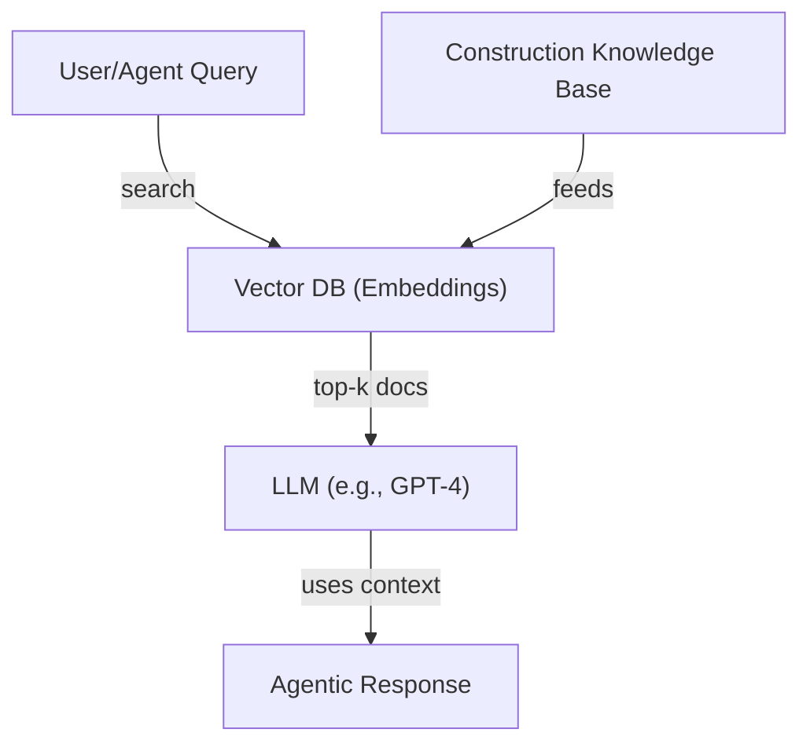

# DcisionAI Agents: The Intelligent Workforce Behind Optimal Decisions

At DcisionAI, we've developed a sophisticated ecosystem of specialized agents that work together to solve complex optimization problems. These agents form the backbone of our platform, each with unique capabilities and roles that contribute to the overall decision-making process.

## The Agent Ecosystem

Our agent ecosystem is designed to handle the complete lifecycle of optimization problems, from initial understanding to final implementation. Each agent type specializes in specific aspects of the problem-solving process, creating a comprehensive and efficient workflow.

### 1. Intent Interpreter Agent

The Intent Interpreter Agent is our first point of contact, specializing in understanding and categorizing business problems:

- **Problem Analysis**
  - Interprets user input using advanced LLM capabilities
  - Identifies the most appropriate optimization problem type
  - Provides confidence scores and alternative problem types
  - Generates detailed reasoning for problem classification
  - Supports multiple problem types including:
    - Vehicle routing
    - Job shop scheduling
    - Resource scheduling
    - Bin packing
    - Project scheduling
    - Fleet scheduling
    - Multi-depot routing
    - Flow shop
    - Nurse scheduling
    - Inventory optimization
    - Production planning
    - Custom optimization scenarios

- **LLM Integration**
  - Uses GPT-3.5-turbo for natural language understanding
  - Structured prompt engineering for consistent outputs
  - JSON response formatting for reliable parsing
  - Confidence scoring for decision transparency
  - Alternative suggestions for problem categorization

### 2. Model Runner Agent

The Model Runner Agent handles the core optimization process:

- **Model Construction**
  - Builds optimization models based on problem type
  - Selects appropriate solvers (OR-Tools based)
  - Constructs variables, constraints, and objectives
  - Validates model components
  - Ensures computational efficiency

- **Solver Integration**
  - OR-Tools VRP for vehicle routing problems
  - OR-Tools CP-SAT for scheduling problems
  - OR-Tools MIP for mixed-integer programming
  - Custom solver selection based on problem type
  - Performance optimization and monitoring

- **Solution Generation**
  - Executes optimization algorithms
  - Tracks solution progress
  - Provides detailed statistics
  - Generates comprehensive logs
  - Validates solution quality

## Agent Collaboration and Communication

Our agents work together through the Model Context Protocol (MCP):

### 1. Workflow Coordination
- Intent Interpreter → Model Runner handoff
- Problem type validation
- Data consistency checks
- Solution verification
- Performance monitoring

### 2. LLM Integration
- GPT-3.5-turbo for natural language processing
- Temperature control (0.2) for consistent outputs
- Structured prompt engineering
- JSON response formatting
- Error handling and recovery

### 3. Solution Pipeline
1. User input interpretation
2. Problem type classification
3. Model construction
4. Solution generation
5. Result validation
6. Implementation guidance

## Advanced Capabilities

Our agents are equipped with sophisticated features:

### 1. Problem Understanding
- Natural language processing
- Context-aware interpretation
- Multi-type classification
- Confidence scoring
- Alternative suggestions

### 2. Optimization Expertise
- OR-Tools integration
- Problem-specific solvers
- Performance optimization
- Solution validation
- Statistical analysis

### 3. Implementation Support
- Detailed solution breakdowns
- Performance metrics
- Implementation guidelines
- Error handling
- Progress tracking

## The Future of DcisionAI Agents

We're continuously evolving our agent ecosystem:

### 1. Enhanced LLM Integration
- Advanced model selection
- Improved prompt engineering
- Better error handling
- Enhanced response parsing
- Expanded problem coverage

### 2. Solver Optimization
- Performance improvements
- New solver integration
- Better resource management
- Enhanced monitoring
- Improved debugging

### 3. User Experience
- Better error messages
- More detailed explanations
- Enhanced visualization
- Improved documentation
- Better support tools

At DcisionAI, we believe that the combination of specialized agents and LLM technology represents the future of optimization. Our agent ecosystem enables businesses to make better decisions, optimize their operations, and achieve their objectives more effectively through intelligent automation and expert guidance.

## Building an LLM-Powered Knowledge Base for Construction Management

### Key Decision Areas for Construction Companies
- Project Planning & Scheduling: Task breakdown, dependencies, timelines, resource allocation.
- Resource Management: Labor, equipment, materials, subcontractors.
- Cost Estimation & Budgeting: Bids, procurement, cost tracking, change orders.
- Risk Management: Safety, compliance, weather, supply chain disruptions.
- Quality Control: Inspections, standards, documentation.
- Contract Management: Legal, claims, payments, documentation.
- Logistics & Supply Chain: Delivery schedules, inventory, site layout.
- Sustainability & Compliance: Environmental, regulatory, reporting.
- Communication & Collaboration: Stakeholder updates, RFIs, meeting notes.

### What Should the Knowledge Base Contain?
- Industry Standards & Best Practices: PMBOK, Lean, BIM, OSHA, etc.
- Company Policies & Templates: Custom procedures, forms, checklists.
- Historical Project Data: Lessons learned, past schedules, cost data.
- External Data: Weather, regulations, supplier catalogs.
- FAQs & How-Tos: Common questions, troubleshooting, workflows.

### How to Build a Knowledge Base for LLM Agents (Current State)

#### A. Data Collection & Organization
- Gather documents: PDFs, DOCs, spreadsheets, emails, manuals, contracts, etc.
- Structure them: Tag by topic, type, and decision area.
- Convert to text/markdown for easy ingestion.

#### B. Embedding & Indexing
- Use an embedding model (e.g., OpenAI, Cohere, or open-source) to convert documents into vector representations.
- Store vectors in a vector database (e.g., Pinecone, Weaviate, Chroma, or Elasticsearch).

#### C. Retrieval-Augmented Generation (RAG)
- When an agent receives a query, use semantic search to retrieve the most relevant knowledge base chunks.
- Pass these chunks as context to the LLM (e.g., GPT-4, Claude, etc.) to generate answers grounded in your knowledge base.

#### D. Agent Integration
- Each agent (Intent, Data, Model Build, Explainability) can query the knowledge base as part of its workflow.
- Example: The Intent Agent can clarify user goals using best practices; the Model Build Agent can reference historical optimization templates.

### How to Implement This in Your Platform
- Knowledge Tab: Allow users to upload documents (CSV, PDF, DOCX, etc.) and tag them.
- Backend: On upload, extract text, chunk it, embed it, and store in your vector DB.
- Agent API: Expose endpoints for agents to query the knowledge base (e.g., `/api/knowledge/search`).
- RAG Pipeline: For every agent LLM call, retrieve relevant context from the knowledge base and include it in the prompt.

### Future State: Custom LLM
- Domain-Specific Pretraining: Fine-tune or pretrain an LLM on your curated construction data.
- Continuous Learning: Use feedback from agent interactions to improve the model.
- Advanced Reasoning: Enable multi-step, tool-using, and multi-agent workflows.

### Example: Current State RAG Pipeline

### Next Steps for Your Platform
1. Set up a vector DB (Pinecone, Weaviate, etc.).
2. Build a document ingestion pipeline (extract, chunk, embed, store).
3. Expose a semantic search API for your agents.
4. Integrate RAG into agent LLM calls.
5. Iterate with real construction data and user feedback. 