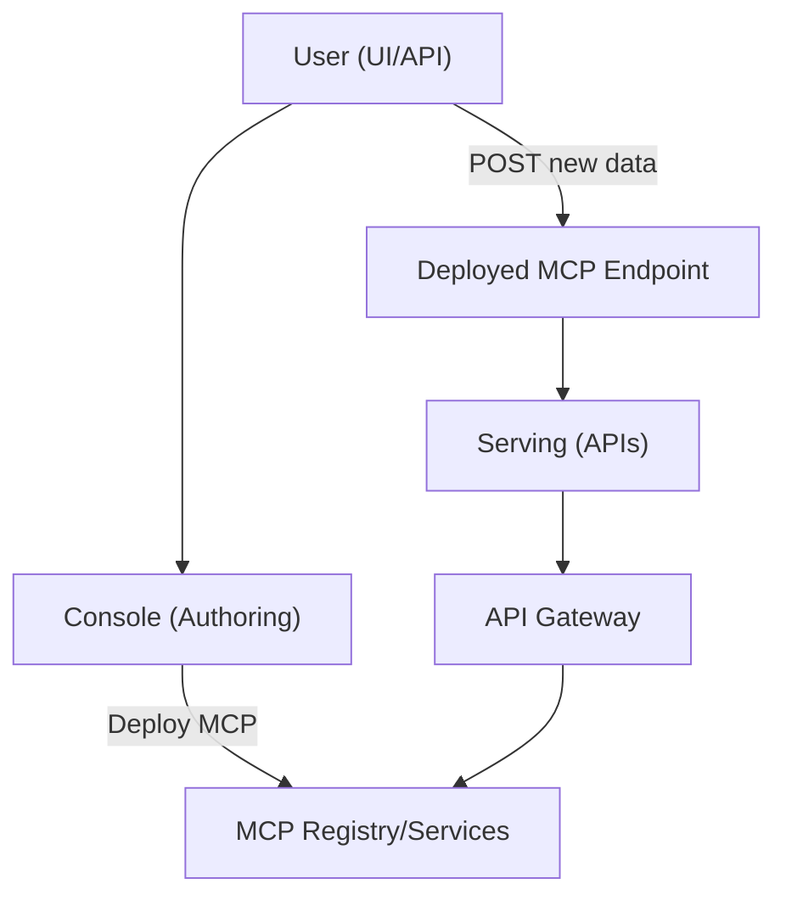

# DcisionAI Platform Overview

## What is DcisionAI?

DcisionAI is a modular, agentic AI platform for intelligent, automated decision-making and optimization. It enables organizations to rapidly build, deploy, and manage AI-powered workflows for complex business problems—especially in domains like construction, logistics, and operations.

---

## Key Use Cases

### For Non-Technical Users
- **Construction Project Managers:**  
  Upload project files (PDF, DOCX, CSV), ask questions, and get actionable insights, risk analysis, and scenario comparisons.
- **Business Analysts:**  
  Build and deploy optimization models (e.g., scheduling, resource allocation) without writing code.
- **Executives:**  
  Visualize KPIs, timelines, and knowledge graphs for better decision-making and compliance.

### For Technical Users
- **Data Scientists/Engineers:**  
  Integrate custom data sources, extend agent logic, and deploy new optimization models.
- **Developers:**  
  Use the open API to automate workflows, connect external systems, or build custom UIs.
- **AI/ML Researchers:**  
  Experiment with LLM-powered retrieval-augmented generation (RAG), knowledge graph extraction, and agent orchestration.

---

## Platform Architecture

### High-Level System Flow

### Core Components

- **Console (UI):**  
  Stepwise, agent-powered workflow for intent interpretation, data prep, model building, and validation.
- **Agents:**  
  Specialized services for intent understanding, data mapping, model building, solving, explainability, and deployment.
- **MCP Registry:**  
  Stores all Model Context Protocols (MCPs), their versions, and deployment status.
- **API Gateway:**  
  Unified entry point for all API requests (authoring, deployment, serving).
- **Knowledge Base & RAG:**  
  Ingests and semantically indexes documents for retrieval-augmented LLM reasoning.
- **Scenario Analysis:**  
  Visual tools for exploring and comparing decision outcomes.

---

## Mathematical Optimization: The Foundation

Mathematical optimization is the computational engine of DcisionAI. It transforms business objectives into actionable solutions by maximizing or minimizing an objective (e.g., cost, time, efficiency) while satisfying constraints (e.g., resources, regulations).

**Types of Optimization Supported:**
- Linear Programming (LP)
- Integer & Mixed-Integer Programming (IP/MIP)
- Nonlinear Programming (NLP)
- Dynamic Programming

**Applications:**
- Supply chain, workforce, and resource optimization
- Project scheduling and crew allocation
- Financial portfolio and budget optimization

**How DcisionAI Uses Optimization:**
- Automatically builds mathematical models from user input and agent-enriched data
- Selects the right solver (e.g., OR-Tools, CP-SAT)
- Provides real-time, explainable results

*See: [docs/platform/mathematical-optimization.md](mathematical-optimization.md)*

---

## Model Context Protocol (MCP): The Heart of Agentic Workflows

The Model Context Protocol (MCP) is DcisionAI's framework for structuring, deploying, and serving optimization models. It ensures every decision is:
- **Structured:** Models, data, and protocols are clearly defined
- **Auditable:** Every step is logged and explainable
- **Extensible:** New agents, models, and data sources can be added easily

**MCP Structure:**
- **Model:** Variables, constraints, and objectives for the optimization problem
- **Context:** Runtime and domain-specific information (e.g., environment, dataset, problem type)
- **Protocol:** The sequence of agent steps (e.g., interpret, collect, enrich, build, solve, explain)

**Agent Roles in MCP:**
- **IntentInterpreterAgent:** Maps user input to structured problems
- **DataCollectorAgent/DataEnricherAgent:** Gathers and enriches data
- **ModelBuilderAgent:** Constructs the optimization model
- **ModelRunnerAgent:** Solves the model
- **SolutionExplainerAgent:** Explains results in plain English

**Serving & Deployment:**
- MCPs are versioned and deployed as real-time endpoints
- Customers POST new data to endpoints for instant optimization and explanations

*See: [docs/architecture/mcp-architecture.md](../architecture/mcp-architecture.md)*

---

## AgenticAI Workflow

1. **Problem Intake:**  
   User describes a business problem (e.g., "Optimize crew allocation for two sites").
2. **Intent Interpretation:**  
   LLM-powered agent classifies the problem and selects a model template.
3. **Data Preparation:**  
   Data agents map, validate, and enrich user data (including RAG-driven best practices).
4. **Model Building:**  
   Model agent constructs an optimization model (e.g., OR-Tools, CP-SAT).
5. **Solving:**  
   The MCP engine solves the model and returns results.
6. **Explainability:**  
   An agent translates the solution into plain English for transparency.
7. **Scenario Analysis:**  
   Users can run "what-if" scenarios and visualize outcomes.
8. **Audit & Memory:**  
   All steps, feedback, and explanations are stored for compliance and continuous improvement.

---

## Technical Deep Dive

### Retrieval-Augmented Generation (RAG) Pipeline

- **Ingestion:**  
  Users upload files or URLs. The system extracts text, chunks it, generates embeddings (OpenAI), and stores vectors in Pinecone.
- **Entity & Relationship Extraction:**  
  Each chunk is processed by an LLM to extract entities and relationships, which are stored as metadata for knowledge graph construction.
- **Querying:**  
  When a user or agent asks a question, the system retrieves the most relevant chunks and uses them as context for the LLM's answer.

### Knowledge Graph

- **Extraction:**  
  Entities and relationships are extracted from ingested documents using LLM prompts.
- **Visualization:**  
  The UI displays an interactive, expandable knowledge graph, allowing users to explore connections between regulations, risks, best practices, and project data.
- **Use Cases:**  
  - Compliance mapping (e.g., OSHA to site safety practices)
  - Risk propagation (e.g., how weather events affect project timelines)
  - Knowledge discovery (e.g., finding relevant standards for a task)

### Agent Orchestration

- **Lead Agent:**  
  Orchestrates the workflow, queries RAG, and delegates to specialized agents.
- **Data Agent:**  
  Enriches user data with best practices and constraints.
- **Model Builder Agent:**  
  Assembles the optimization model and protocol.
- **Explainability Agent:**  
  Provides human-readable explanations and audit trails.

### Scenario Analysis

- **What-If Engine:**  
  Users can adjust parameters (e.g., crew size, shift patterns) and instantly see the impact on cost, timeline, and risk.
- **Visualization:**  
  Gantt charts, radar charts, and KPI dashboards help users compare scenarios.

---

## Example: Construction Crew Allocation

1. **Upload project data** (sites, crews, tasks, union rules).
2. **System extracts** entities (sites, crews, tasks) and relationships (crew-to-site assignments, task dependencies).
3. **Lead Agent** queries RAG for best practices and union constraints.
4. **Model Builder** assembles an MCP config for crew allocation.
5. **MCP Engine** solves for optimal assignments.
6. **Explainability Agent** provides a plain-English summary:  
   "Crew 1 is assigned to Downtown Office Tower for the day shift due to their concrete skills and availability. Union rules were respected."
7. **Scenario Analysis** lets the user adjust priorities or add/remove crews and see updated solutions.

---

## Value for Non-Technical Users

- **No code required:**  
  Use a stepwise UI to upload data, ask questions, and deploy solutions.
- **Transparency:**  
  Every decision is explained in plain English.
- **Scenario exploration:**  
  Instantly see the impact of changes.

## Value for Technical Users

- **Extensible:**  
  Add new agent types, models, or data sources.
- **API-first:**  
  Integrate with external systems or automate workflows.
- **Customizable:**  
  Tune LLM prompts, extraction logic, and optimization models.

---

## Security, Auditability, and Compliance

- **Audit Trail:**  
  Every step, decision, and data change is logged.
- **Human-in-the-Loop:**  
  Users can review, approve, or override decisions.
- **Compliance:**  
  Map decisions to regulations and standards (e.g., OSHA, PMBOK).

---

## Getting Started

- **Deploy locally or in the cloud** using Docker and Terraform.
- **Upload your data** and start building knowledge-driven optimization workflows.
- **Explore the UI** for dashboards, knowledge graphs, and scenario analysis.

---

## Learn More

- [Architecture Overview](../architecture/overview.md)
- [Agent System](dcisionai-agents.md)
- [Mathematical Optimization](mathematical-optimization.md)
- [MCP Architecture](../architecture/mcp-architecture.md)
- [Construction Use Case](construction-architecture.md)
- [API Reference](../api/README.md) 