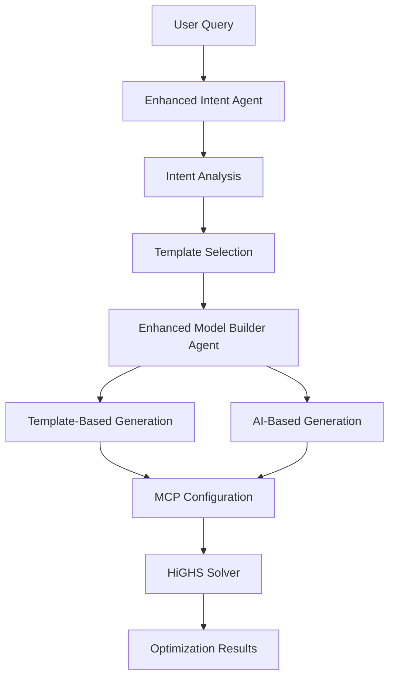

# Enhanced Agents Integration Guide

## Overview

This guide documents the enhanced Intent Agent and Model Builder Agent integration with the optimization template system. The agents now work together to provide production-scale optimization models using pre-built templates.

## Architecture



## Enhanced Intent Agent

### New Capabilities

The Intent Agent now provides enhanced classification for optimization problems:

#### 1. **Optimization Problem Types**
- `crew_assignment` - Workforce scheduling and crew allocation
- `resource_allocation` - Equipment, material, and resource distribution  
- `cost_optimization` - Cost minimization and budget optimization
- `supply_chain` - Supplier selection and logistics optimization
- `risk_management` - Risk mitigation and safety optimization
- `project_scheduling` - Task sequencing and timeline optimization
- `equipment_allocation` - Equipment assignment and utilization
- `material_optimization` - Material selection and quantity optimization

#### 2. **Model Types**
- `LP` (Linear Programming) - Linear objective and constraints
- `MIP` (Mixed Integer Programming) - Some variables must be integers
- `QP` (Quadratic Programming) - Quadratic objective function
- `NLP` (Non-Linear Programming) - Non-linear objective or constraints

#### 3. **Problem Complexity**
- `basic` - Simple problems with few variables and constraints
- `intermediate` - Moderate complexity with realistic constraints
- `advanced` - Complex problems with many variables and sophisticated constraints

### Enhanced Interface

```typescript
export interface IntentResult {
  decisionType: string;
  confidence: number;
  reasoning: string;
  ragQuery?: string;
  optimizationQuery?: string;
  keywords: string[];
  primaryIntent: string;
  secondaryIntent?: string;
  // Enhanced optimization classification
  optimizationType?: string;
  modelType?: 'LP' | 'MIP' | 'QP' | 'NLP';
  problemComplexity?: 'basic' | 'intermediate' | 'advanced';
  templateRecommendations?: string[];
  extractedParameters?: Record<string, any>;
}
```

### Example Intent Analysis

```typescript
// Input: "Optimize crew allocation for our construction project"
const intent = await agnoIntentAgent.analyzeIntent(userInput);

// Result:
{
  decisionType: "resource-allocation",
  primaryIntent: "optimization",
  optimizationType: "crew_assignment",
  modelType: "MIP",
  problemComplexity: "basic",
  templateRecommendations: ["crew_assignment_basic"],
  extractedParameters: {
    budget_limit: 50000,
    time_limit: 30,
    crew_types: ["carpenters", "electricians", "plumbers"],
    constraints: ["availability", "minimum_requirements"]
  },
  confidence: 0.92,
  reasoning: "This is a crew assignment optimization problem requiring integer variables for worker counts"
}
```

## Enhanced Model Builder Agent

### Template-First Approach

The Model Builder Agent now uses a template-first approach:

1. **Template Selection** - Selects the best template based on intent analysis
2. **Template Customization** - Applies user parameters and constraints
3. **MCP Conversion** - Converts template to MCP format
4. **Validation** - Ensures the generated model is solvable
5. **Fallback** - Falls back to AI generation if template approach fails

### Template Integration

```typescript
async buildModel(enrichedData: any, intent: any): Promise<ModelBuilderResult> {
  // Step 1: Try template-based approach
  const selectedTemplate = selectBestTemplate(intent);
  if (selectedTemplate) {
    const customizations = this.extractCustomizations(enrichedData, intent);
    const mcpConfig = convertTemplateToMCP(selectedTemplate, customizations);
    
    if (isSolvableMCPConfig(mcpConfig)) {
      return {
        mcpConfig,
        confidence: 0.9,
        reasoning: `Successfully generated model using template: ${selectedTemplate.name}`,
        templateUsed: selectedTemplate.template_id,
        templateCustomizations: customizations
      };
    }
  }
  
  // Step 2: Fallback to AI generation
  // ... existing AI-based generation logic
}
```

### Template Customization

The agent can customize templates with:

- **Parameters** - Budget limits, time constraints, etc.
- **Constraints** - Custom RHS values for constraints
- **Objective Coefficients** - Custom objective function weights
- **Variable Bounds** - Custom variable bounds

```typescript
function extractCustomizations(enrichedData: any, intent: any): Record<string, any> {
  const customizations: Record<string, any> = {};
  
  // Extract parameters from intent
  if (intent.extractedParameters) {
    customizations.parameters = intent.extractedParameters;
  }
  
  // Extract budget constraints from enriched data
  if (enrichedData.costs?.total_budget) {
    customizations.parameters = {
      ...customizations.parameters,
      budget_limit: enrichedData.costs.total_budget
    };
  }
  
  // Extract crew availability from enriched data
  if (enrichedData.resources?.crews) {
    const crewConstraints: number[] = [];
    enrichedData.resources.crews.forEach((crew: any) => {
      if (crew.availability) {
        crewConstraints.push(crew.availability);
      }
    });
    if (crewConstraints.length > 0) {
      customizations.constraints = crewConstraints;
    }
  }
  
  return customizations;
}
```

## Template System Integration

### Template Selection Logic

```typescript
function selectBestTemplate(intent: any): OptimizationTemplate | null {
  // 1. Try recommended templates from intent
  const templateIds = intent.templateRecommendations || [];
  for (const templateId of templateIds) {
    const template = templateLoader.getTemplate(templateId);
    if (template) return template;
  }
  
  // 2. Search by optimization type
  if (intent.optimizationType) {
    const recommendations = templateLoader.getTemplateRecommendations(
      intent.optimizationType, 'construction'
    );
    if (recommendations.length > 0) {
      return recommendations[0].template;
    }
  }
  
  // 3. Fallback to any construction template
  const constructionTemplates = templateLoader.getTemplatesByDomain('construction');
  return constructionTemplates.length > 0 ? constructionTemplates[0] : null;
}
```

### Template to MCP Conversion

```typescript
function convertTemplateToMCP(template: OptimizationTemplate, customizations?: Record<string, any>): MCPConfig {
  const customizedTemplate = customizations ? customizeTemplate(template, customizations) : template;
  
  // Convert variables
  const variables = customizedTemplate.variables.map(v => ({
    name: v.name,
    type: v.type === 'int' ? 'integer' : v.type === 'bin' ? 'binary' : 'continuous',
    lower_bound: v.bounds.lower,
    upper_bound: v.bounds.upper,
    description: v.description
  }));

  // Convert constraints
  const constraints = {
    dense: customizedTemplate.constraints.dense.map((row, index) => ({
      name: `constraint_${index}`,
      coefficients: row,
      variables: customizedTemplate.variables.map(v => v.name),
      operator: customizedTemplate.constraints.sense[index],
      rhs: customizedTemplate.constraints.rhs[index],
      description: customizedTemplate.constraints.descriptions?.[index] || `Constraint ${index}`
    })),
    sparse: []
  };

  // Convert objective
  const objective = {
    name: customizedTemplate.objective.target,
    sense: customizedTemplate.sense,
    coefficients: customizedTemplate.objective.linear || [],
    variables: customizedTemplate.variables.map(v => v.name),
    description: customizedTemplate.objective.description
  };

  return { variables, constraints, objective, solver_config: customizedTemplate.solver_config };
}
```

## Usage Examples

### Example 1: Crew Assignment

```typescript
// User input
const userInput = "Optimize crew allocation for our construction project";

// Intent analysis
const intent = await agnoIntentAgent.analyzeIntent(userInput);
// Result: optimizationType: "crew_assignment", modelType: "MIP"

// Model building
const result = await agnoModelBuilderAgent.buildModel(enrichedData, intent);
// Result: Uses crew_assignment_basic template, generates MIP model with 4 variables, 4 constraints
```

### Example 2: Cost Optimization

```typescript
// User input
const userInput = "Minimize costs while meeting quality requirements";

// Intent analysis
const intent = await agnoIntentAgent.analyzeIntent(userInput);
// Result: optimizationType: "cost_optimization", modelType: "LP"

// Model building
const result = await agnoModelBuilderAgent.buildModel(enrichedData, intent);
// Result: Uses cost_optimization_basic template, generates LP model with 4 variables, 3 constraints
```

### Example 3: Supply Chain

```typescript
// User input
const userInput = "Optimize our supply chain with multiple suppliers";

// Intent analysis
const intent = await agnoIntentAgent.analyzeIntent(userInput);
// Result: optimizationType: "supply_chain", modelType: "LP"

// Model building
const result = await agnoModelBuilderAgent.buildModel(enrichedData, intent);
// Result: Uses supply_chain_basic template, generates LP model with 4 variables, 5 constraints
```

## Benefits

### 1. **Production-Ready Models**
- Templates are pre-tested and validated
- Consistent problem structures across similar use cases
- Reliable solver performance

### 2. **Fast Model Generation**
- Template-based generation is much faster than AI generation
- Reduced API calls to language models
- Consistent response times

### 3. **Better Quality**
- Templates ensure solvable problems
- Industry-standard constraints and objectives
- Proper variable types and bounds

### 4. **Easy Maintenance**
- Templates can be updated independently
- New templates can be added without changing agent logic
- Version control for optimization models

### 5. **Flexibility**
- Templates can be customized with user parameters
- Fallback to AI generation for edge cases
- Support for multiple problem types and complexities

## Testing

Run the integration tests:

```bash
cd src/templates/optimization
node test-enhanced-agents.js
```

This tests:
- Template loading and validation
- Intent classification accuracy
- Template selection logic
- MCP configuration generation
- End-to-end workflow

## Future Enhancements

### 1. **Advanced Template Features**
- Template versioning and compatibility
- Template composition (combining multiple templates)
- Dynamic template generation based on patterns

### 2. **Enhanced Customization**
- Visual template editor
- Template parameter validation
- Custom constraint builder

### 3. **Performance Optimization**
- Template caching
- Parallel template processing
- Template pre-compilation

### 4. **Domain Expansion**
- Templates for other industries (retail, finance, etc.)
- Cross-domain template sharing
- Industry-specific optimizations

## Conclusion

The enhanced Intent Agent and Model Builder Agent integration provides a robust, production-ready system for generating optimization models. By combining template-based generation with AI fallback, the system ensures both reliability and flexibility while maintaining high performance and quality standards. 